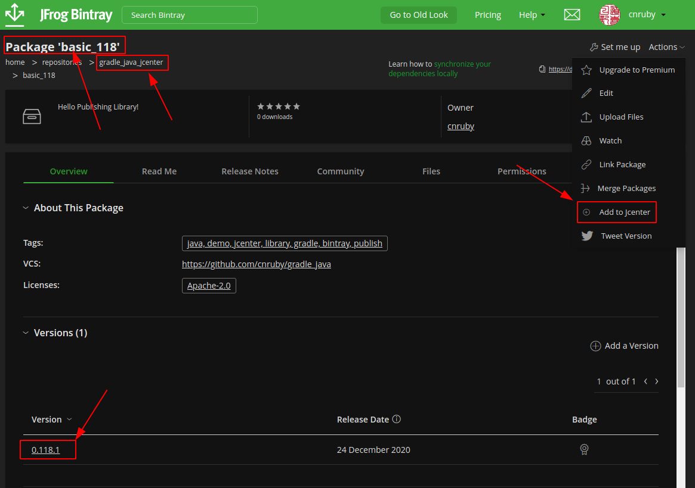
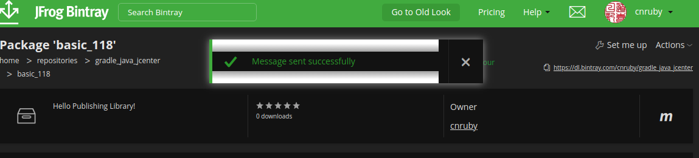
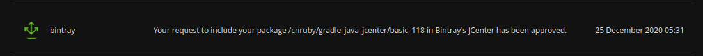

<a href = "https://openjdk.java.net/">

</a>


[](https://ubuntu.com/)
[](https://github.com/shyiko/jabba)
[](https://www.azul.com/downloads/zulu-community/?package=jdk)
[](https://gradle.org/)
[](https://app.circleci.com/pipelines/github/cnruby/gradle_java?branch=basic_118)
[](https://github.com/cnruby/gradle_java/actions?query=workflow%3ACI--basic_118)
[](https://github.com/cnruby/gradle_java/actions)
[  ](https://bintray.com/cnruby/gradle_java_jcenter/basic_118/0.118.1/link)


---


basic_118 Hello Publishing Library!
<h1>Lesson 118: Hello Publishing Library!</h1>

- Publish a Java Library from multi-project to JCenter


---


- [Keywords](#keywords)
- [Prerequisites](#prerequisites)
- [Create a Java Project from GitHub.com](#create-a-java-project-from-githubcom)
- [add `bintray.com` Account Info to the file "~/jcenter.properties"](#add-bintraycom-account-info-to-the-file-jcenterproperties)
- [Develop the root project](#develop-the-root-project)
  - [add a gradle properties file `gradle.properties`](#add-a-gradle-properties-file-gradleproperties)
  - [add new build.gradle for the project](#add-new-buildgradle-for-the-project)
- [Develop the subproject `app`](#develop-the-subproject-app)
  - [change build.gradle for the subproject "app"](#change-buildgradle-for-the-subproject-app)
- [Develop the subproject `lib`](#develop-the-subproject-lib)
  - [change the gradle build file `lib/build.gradle`](#change-the-gradle-build-file-libbuildgradle)
- [check, build and run the main Java application](#check-build-and-run-the-main-java-application)
- [Publish the Library](#publish-the-library)
- [!!! Add to JCenter](#-add-to-jcenter)
  - [Click "Add to JCenter"](#click-add-to-jcenter)
  - [Waiting until you get a notification](#waiting-until-you-get-a-notification)
  - [Browse the JCenter Library Files](#browse-the-jcenter-library-files)
- [Download and Use This complete Project](#download-and-use-this-complete-project)
- [Main's Referenecs](#mains-referenecs)
- [Referenecs](#referenecs)


## Keywords
- `Java Multi-Project` `gradle projects` `own java library`
- Ubuntu Java Gradle gradlew tutorial example library


## Prerequisites
- [install JDK on Ubuntu 20.04](https://github.com/cnruby/gradle_java/blob/basic_101/README.md)
- [install Gradle on Ubuntu 20.04](https://github.com/cnruby/gradle_java/blob/basic_102/README.md)
- [Bintray Account](https://bintray.com/login?forwardedFrom=%2F)
- [Learn "Hello jcenter!"](https://github.com/cnruby/gradle_java/tree/basic_004)
- [Learn "Hello Gradle Properties!"](https://github.com/cnruby/gradle_java/tree/basic_116)


## Create a Java Project from GitHub.com

```bash
# DO (open a new terminal)
EXISTING_APP_ID=115 && NEW_APP_ID=118 \
&& git clone -b basic_${EXISTING_APP_ID}  \
    https://github.com/cnruby/gradle_java.git ${NEW_APP_ID}_gradle_java \
&& cd ${NEW_APP_ID}_gradle_java
```

```bash
# DO (check the project)
./gradlew check
```


## add `bintray.com` Account Info to the file "~/jcenter.properties"

```bash
# IF NOT EXIST(~/jcenter.properties)
    # DO (copy a jcenter's username and password sample file)
    cp ./jcenter.properties.sample ~/jcenter.properties
    
    # DO (edit the real jcenter's username and password)
    # !!! first sign in JCenter by jcenter's username and password              
    nano ~/jcenter.properties
# ENDIF
```


## Develop the root project 

### add a gradle properties file `gradle.properties`

```bash
# DO (create a file ./gradle.properties)
touch ./gradle.properties

# DO (edit the file ./gradle.properties)
nano ./gradle.properties

    # FILE (./gradle.properties)
    bintrayRepo=gradle_java_jcenter
    libraryName=basic_118
    group=de.iotoi
    version=0.118.1
    description=Hello Publishing Library!
    vcsUrl=https://github.com/cnruby/gradle_java
```

### add new build.gradle for the project

```bash
# DO (create a build file ./build.gradle)
touch ./build.gradle

# DO (edit a build file ./build.gradle)
nano ./build.gradle

    # FILE (./build.gradle)
    plugins {
        id 'java'
    }

    sourceCompatibility = JavaVersion.VERSION_11

    repositories {
        mavenCentral()
        jcenter()
    }
```


## Develop the subproject `app`

### change build.gradle for the subproject "app"

```bash
# DO (edit a build file ./app/build.gradle)
nano ./app/build.gradle

    # FILE (./app/build.gradle)
    plugins {
        id 'application'
    }

    dependencies {
        implementation project(':lib')
    }

    application {
        mainClass = "de.iotoi.App"
    }

    test {}
```


## Develop the subproject `lib`

### change the gradle build file `lib/build.gradle`

```bash
# DO (edit the file `lib/build.gradle`)
nano lib/build.gradle

    # FILE (lib/build.gradle)
    plugins {
        id 'java-library'
        id 'com.jfrog.bintray' version '1.8.5'
        id 'maven-publish'
    }

    apply from: System.getenv("HOME") + "/jcenter.properties"

    dependencies {}
    test {}

    tasks.named('jar') {
        baseName = project.libraryName
        manifest {
            attributes('Implementation-Title': project.libraryName,
                    'Implementation-Version': project.version)
        }
    }

    task sourcesJar(type: Jar, dependsOn: classes){
        baseName = project.libraryName
        classifier = 'sources'
        from sourceSets.main.allSource
    }

    publishing{
        publications{
            "$project.name"(MavenPublication){
                from components.java
                groupId project.group
                artifactId project.libraryName
                version project.version
                artifact sourcesJar
            }
        }
    }

    bintray{
        user = project.bintrayUser
        key = project.bintrayApiKey
        publications = ["$project.name"]
        publish = true // !!!
        pkg{
            repo = project.bintrayRepo
            name = project.libraryName
            desc = project.description
            licenses = ['Apache-2.0']
            vcsUrl = project.vcsUrl
            labels = ['java, demo, jcenter, library, gradle, bintray, publish, example, tutorial']
            version {
                name = project.version
                released = new Date()
            }
        }
    }
```


## check, build and run the main Java application

```bash
# DO (build subproject `app` and `lib`)
./gradlew -q check
    # >> Result: nothing
```

```bash
# DO (build subproject `app` and `lib`)
./gradlew clean app:build
```

```bash
# DO (run the java application for the subproject `app` )
./gradlew -q app:run
    # >> Result:
    Hello world.
```


## Publish the Library

```bash
# DO (check)
./gradlew check
    # >> Result: nothing

# DO (build and publsih the java library)
./gradlew clean build bintrayUpload
    # >> Result
    > Task :lib:bintrayUpload
    Uploading to https://api.bintray.com/content/cnruby/gradle_java_jcenter/basic_118/0.118.1/de/iotoi/lib/0.118.1/lib-0.118.1-sources.jar...
    Uploaded to 'https://api.bintray.com/content/cnruby/gradle_java_jcenter/basic_118/0.118.1/de/iotoi/lib/0.118.1/lib-0.118.1-sources.jar'.
    Uploading to https://api.bintray.com/content/cnruby/gradle_java_jcenter/basic_118/0.118.1/de/iotoi/lib/0.118.1/lib-0.118.1.jar...
    Uploaded to 'https://api.bintray.com/content/cnruby/gradle_java_jcenter/basic_118/0.118.1/de/iotoi/lib/0.118.1/lib-0.118.1.jar'.
    Uploading to https://api.bintray.com/content/cnruby/gradle_java_jcenter/basic_118/0.118.1/de/iotoi/lib/0.118.1/lib-0.118.1.pom...
    Uploaded to 'https://api.bintray.com/content/cnruby/gradle_java_jcenter/basic_118/0.118.1/de/iotoi/lib/0.118.1/lib-0.118.1.pom'.

    Deprecated Gradle features were used in this build, making it incompatible with Gradle 7.0.
    Use '--warning-mode all' to show the individual deprecation warnings.
    See https://docs.gradle.org/6.7.1/userguide/command_line_interface.html#sec:command_line_warnings

    BUILD SUCCESSFUL in 8s
    8 actionable tasks: 5 executed, 3 up-to-date
```


## !!! Add to JCenter

### Click "Add to JCenter"



### Waiting until you get a notification
- And that’s it! You have to wait until you get a notification in bintray that your library has been accepted to join JCenter before anyone can begin to use your library.



### Browse the JCenter Library Files

```bash
google-chrome https://jcenter.bintray.com/de/iotoi/basic_118/0.118.1
```


## Download and Use This complete Project

```bash
# Download
git clone -b basic_118 https://github.com/cnruby/gradle_java.git basic_118
```

```bash
# Usage for the project
google-chrome https://github.com/cnruby/gradle_java/releases/tag/v0.118.1
```


## Main's Referenecs
- http://andresalmiray.com/publishing-artifacts-to-maven-central-with-bintray-gradle/


## Referenecs
- https://docs.github.com/en/free-pro-team@latest/actions/learn-github-actions/introduction-to-github-actions
- https://medium.com/@shanemyrick/publishing-to-github-packages-with-gradle-and-github-actions-4ad842634c4e
- https://www.flowsquad.io/blog/2020-05-29-devops-mit-github-teil-1-github-packages-mit-gradle/
- https://docs.github.com/en/free-pro-team@latest/packages/guides/configuring-gradle-for-use-with-github-packages
- https://docs.github.com/en/free-pro-team@latest/actions/guides/publishing-java-packages-with-gradle
- https://medium.com/@anitaa_1990/6-easy-steps-to-upload-your-android-library-to-bintray-jcenter-59e6030c8890
- https://www.jfrog.com/confluence/display/BT/Central+Repositories
- https://stackoverflow.com/questions/42035918/there-is-no-add-to-jcenter-button-in-https-bintray-com
- https://stackoverflow.com/questions/1078524/how-to-specify-the-location-with-wget
- https://stackoverflow.com/questions/20700053/how-to-add-local-jar-file-dependency-to-build-gradle-file
- https://stackoverflow.com/questions/17262856/how-to-set-the-project-name-group-version-plus-source-target-compatibility-in
- https://docs.github.com/en/free-pro-team@latest/actions/guides/building-and-testing-java-with-gradle
- https://github.com/marketplace/actions/gradle-command
- https://stackoverflow.com/questions/17395787/how-to-replace-a-string-word-in-a-text-file-in-groovy

