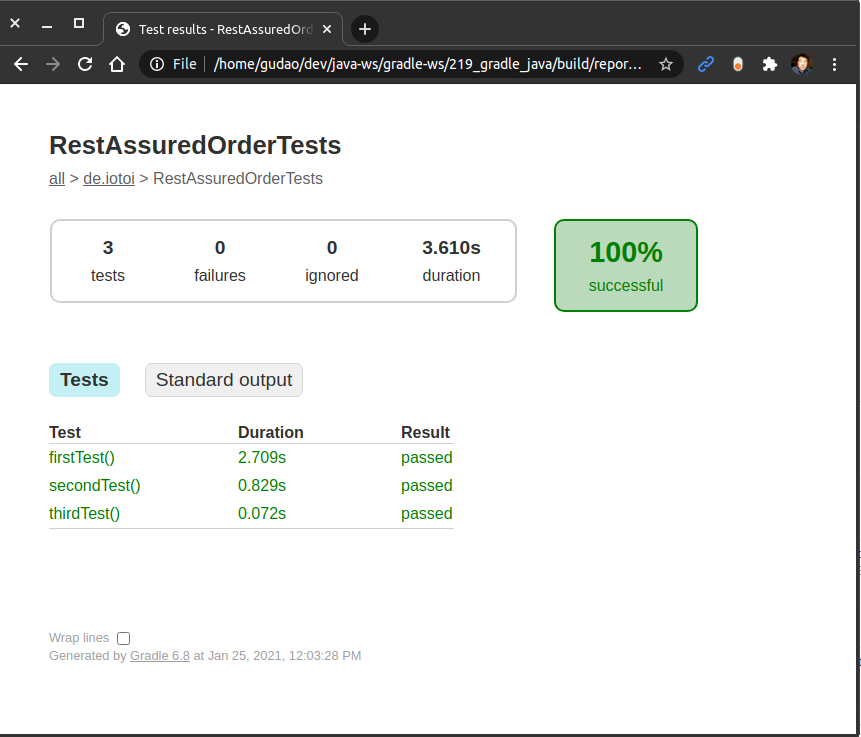

<a href = "https://openjdk.java.net/">

</a>

[](https://ubuntu.com/)
[](https://github.com/shyiko/jabba)
[](https://gradle.org/)
[](https://www.azul.com/downloads/zulu-community/?package=jdk)
[](https://www.jetbrains.com/de-de/idea/download/#section=linux)
[](https://www.docker.com/)
[](https://app.circleci.com/pipelines/github/cnruby/gradle_java?branch=basic_219)


---

Lesson 219: Hello @Order!
<h1>Lesson 219: Hello @Order!</h1>

- How to Understand The Annotation @Order!


---


- [Keywords](#keywords)
- [Prerequisites](#prerequisites)
- [Create A New Java Web App](#create-a-new-java-web-app)
  - [DO (create a new project)](#do-create-a-new-project)
  - [DO (check the project)](#do-check-the-project)
- [Develop REST Assured Testing about the Annotation @Order](#develop-rest-assured-testing-about-the-annotation-order)
  - [DO (add a new book testing file with the annotation @Order)](#do-add-a-new-book-testing-file-with-the-annotation-order)
  - [DO (check the project without test)](#do-check-the-project-without-test)
- [Test The Project](#test-the-project)
  - [DO (start the web app)](#do-start-the-web-app)
  - [DO (run the testing in the project with gradle)](#do-run-the-testing-in-the-project-with-gradle)
  - [DO (see the testing report)](#do-see-the-testing-report)
- [References](#references)
- [References for tools](#references-for-tools)


## Keywords
- Annotation `@Order` `Rest Assured` `Web Application` REST API Testing
- `Java JDK` `IntelliJ CE` CircleCI CI
- tutorial example Ubuntu Gradle jabba JDK Java JVM
- `Spring Boot` database Console DataSource


## Prerequisites
- [install JDK on Ubuntu 20.04](https://github.com/cnruby/gradle_java/blob/basic_101/README.md)
- [install Gradle on Ubuntu 20.04](https://github.com/cnruby/gradle_java/blob/basic_102/README.md)
- [IntelliJ IDEA Community](https://www.jetbrains.com/de-de/idea/download/#section=linux)
- [install Docker on Ubuntu](https://docs.docker.com/engine/install/ubuntu/) OR [Using Docker](https://github.com/cnruby/gradle_java/tree/basic_002)
- [CircleCI Account](https://circleci.com/vcs-authorize/)


## Create A New Java Web App

### DO (create a new project)
```bash
EXISTING_APP_ID=218 && NEW_APP_ID=219 \
&& git clone -b basic_${EXISTING_APP_ID} https://github.com/cnruby/gradle_java.git ${NEW_APP_ID}_gradle_java \
&& cd ${NEW_APP_ID}_gradle_java
```

### DO (check the project)
```bash
./gradlew -q clean check
```
```bash
    # >> Result:nothing
```


## Develop REST Assured Testing about the Annotation @Order

### DO (add a new book testing file with the annotation @Order)
```bash
touch ./src/test/java/de/iotoi/RestAssuredOrderTests.java
```
```bash
nano ./src/test/java/de/iotoi/RestAssuredOrderTests.java
```
```java
// FILE (RestAssuredOrderTests.java)
package de.iotoi;

import de.iotoi.model.Book;
import io.restassured.RestAssured;
import io.restassured.response.Response;
import org.junit.jupiter.api.*;
import org.springframework.http.HttpStatus;
import org.springframework.http.MediaType;

import static org.apache.commons.lang3.RandomStringUtils.randomAlphabetic;
import static org.assertj.core.api.Assertions.*;

@TestMethodOrder(MethodOrderer.OrderAnnotation.class)
public class RestAssuredOrderTests {
    private static final String API_ROOT
            = "http://localhost:8080/api/books";

    private static StringBuilder output = new StringBuilder("");

    private Book createRandomBook() {
        Book book = new Book();
        book.setTitle(randomAlphabetic(10));
        book.setAuthor(randomAlphabetic(15));
        return book;
    }

    @Test
    @Order(1)
    public void firstTest() {
        Response response = RestAssured.get(API_ROOT);
        assertThat(HttpStatus.OK.value()).isEqualTo(response.getStatusCode());

        // if (mv SecurityConfig.java SecurityConfig.java.txt)
        // then (Status Code is 401)

        output.append("a");
    }

    @Test
    @Order(2)
    public void secondTest() {
        Book book = createRandomBook();
        Response response = RestAssured.given()
                .contentType(MediaType.APPLICATION_JSON_VALUE)
                .body(book)
                .post(API_ROOT);
        assertThat(HttpStatus.CREATED.value()).isEqualTo(response.getStatusCode());

        output.append("b");
    }

    @Test
    @Order(3)
    public void thirdTest() {
        Response response = RestAssured.get(API_ROOT);
        assertThat(HttpStatus.OK.value()).isEqualTo(response.getStatusCode());

        output.append("c");
    }

    @AfterAll
    public static void assertOutput() {
        assertThat(output.toString()).isEqualTo("abc");
    }
}
```

### DO (check the project without test)
```bash
./gradlew -q check -x test
```


## Test The Project

### DO (start the web app)
```bash
./gradlew -q bootRun
```
```bash
    # >> Result
    <==========---> 83% EXECUTING [10s]
    > :bootRun
```

### DO (run the testing in the project with gradle)
```bash
./gradlew -q clean test --tests de.iotoi.RestAssuredOrderTests
```
```bash
    # >> Result: nothing
```

### DO (see the testing report)
```bash
google-chrome ./build/reports/tests/test/index.html
```



## References
- https://rest-assured.io/
- https://github.com/rest-assured/rest-assured/wiki/GettingStarted
- https://docs.gradle.org/current/userguide/building_java_projects.html
- https://stackoverflow.com/questions/53790182/get-the-current-value-of-illegal-access-setting-in-java
- https://www.gitmemory.com/issue/spring-projects/spring-boot/22303/656792408
- https://backstage.forgerock.com/knowledge/kb/article/a15048811
- https://github.com/gradle/gradle/releases
- https://www.xspdf.com/resolution/58300460.html
- https://www.xspdf.com/resolution/52404548.html
- https://docs.microsoft.com/en-us/azure/developer/java/fundamentals/transition-from-java-8-to-java-11
- https://stackoverflow.com/questions/4597850/gradle-build-without-tests


## References for tools
- [Add a copy to clipboard button in a GitHub](https://github.com/zenorocha/codecopy#install)
