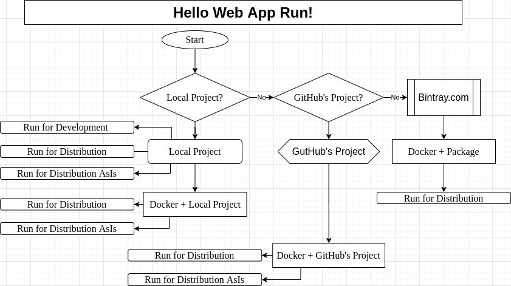

<a href = "https://openjdk.java.net/">

</a>

[](https://ubuntu.com/)
[](https://github.com/shyiko/jabba)
[](https://www.azul.com/downloads/zulu-community/?package=jdk)
[](https://www.jetbrains.com/de-de/idea/download/#section=linux)
[](https://www.docker.com/)
[](https://github.com/eclipse/jetty.project)
[](https://github.com/akhikhl/gretty)
[](https://app.circleci.com/pipelines/github/cnruby/gradle_java?branch=basic_122)


---

basic_122 Hello Web App Run
<h1>Lesson 122: Hello Web App Run!</h1>

- How to Run A Web Application with Local Project
- How to Run A Web Application with Docker

---


- [Keywords](#keywords)
- [Prerequisites](#prerequisites)
- [Map for this Project](#map-for-this-project)
- [Create a Java Web Application from GitHub.com](#create-a-java-web-application-from-githubcom)
- [Run the Web Project's Application](#run-the-web-projects-application)
  - [Run this project as a JVM web application](#run-this-project-as-a-jvm-web-application)
  - [Run this project as a distribution](#run-this-project-as-a-distribution)
  - [Run this project as a distribution as-is](#run-this-project-as-a-distribution-as-is)
- [Run the Web Local's Project on Docker](#run-the-web-locals-project-on-docker)
  - [Run a Distribution on Docker](#run-a-distribution-on-docker)
  - [Run a Distribution AsIs on Docker](#run-a-distribution-asis-on-docker)
- [Run the GitHub's Project on Docker](#run-the-githubs-project-on-docker)
  - [Run a distribution on Docker](#run-a-distribution-on-docker-1)
  - [Run as a distribution as-is on Docker](#run-as-a-distribution-as-is-on-docker)
- [Run the Web published Application on Docker](#run-the-web-published-application-on-docker)
- [Download and Use This complete Project](#download-and-use-this-complete-project)
  - [Usage for the project](#usage-for-the-project)
- [References](#references)


## Keywords
- Docker `Web Application` `web-app` `run webapp` webapp GitHub web-app
- Ubuntu Java Gradle tutorial example
- `Continuous Integration` CI `Continuous Deployment` CD CircleCI
- `gradle plugin` Gretty jetty `web server`


## Prerequisites
- [install JDK on Ubuntu 20.04](https://github.com/cnruby/gradle_java/blob/basic_101/README.md)
- [install Gradle on Ubuntu 20.04](https://github.com/cnruby/gradle_java/blob/basic_102/README.md)
- [IntelliJ IDEA Community](https://www.jetbrains.com/de-de/idea/download/#section=linux)
- [install Docker on Ubuntu](https://docs.docker.com/engine/install/ubuntu/) OR [Using Docker](https://github.com/cnruby/gradle_java/tree/basic_002)


## Map for this Project



## Create a Java Web Application from GitHub.com

```bash
# DO (open a new terminal)
EXISTING_APP_ID=111 && NEW_APP_ID=122 \
&& git clone -b basic_${EXISTING_APP_ID} \
    https://github.com/cnruby/gradle_java.git ${NEW_APP_ID}_gradle_java \
&& cd ${NEW_APP_ID}_gradle_java
```

```bash
./gradlew -q check
    # >> Result: nothing
```


## Run the Web Project's Application

### Run this project as a JVM web application
```bash
# DO (start web server with webapp)
./gradlew appRun
# DO (Press any key to stop the server) IF stop the server

# DO (open a new terminal)
curl http://localhost:8080/
    # >> Result
    <!DOCTYPE html>
    <html lang="en">
    <head>
        <meta charset="UTF-8">
        <title>Hello Web App Run!</title>
    </head>
    <body>
    <center>
        <h1>Hello Web App Run!</h1>
    </center>
    </body>
    </html>
# DO (open a servlet page)
curl -L http://localhost:8080/hello
    # >> Result
    [8,3,2,1,8]
```

### Run this project as a distribution
```bash
# DO (build the project)
./gradlew clean build

# DO (Starts web-app on WAR-file)
./gradlew appStartWar

# DO (open a new terminal)
google-chrome http://localhost:8080/
    # >> Result
    Hello Web App Run!
# DO (open a servlet page)
google-chrome http://localhost:8080/hello
    # >> Result
    [8,3,2,1,8]
```

### Run this project as a distribution as-is
```bash
# DO (create a web application on local)
./gradlew archiveAllProducts

# DO (start a web server with web application)
./build/output/_gradle_java/start.sh
# IF stop the web server
    # DO (open a new terminal)
    # DO (stop the web server) 
    ./build/output/_gradle_java/stop.sh
# ENDIF

# DO (open a new terminal)
google-chrome http://localhost:8080/
    # >> Result
    Hello Web App Run!
# DO (open a servlet page)
google-chrome http://localhost:8080/hello
    # >> Result
    [8,3,2,1,8]
```


## Run the Web Local's Project on Docker

### Run a Distribution on Docker
```bash
# DO (make a folder for Docker build files)
mkdir Dockerfiles

# DO (create a docker build file)
touch ./Dockerfiles/src.dist.Dockerfile

# DO (edit the docker build file)
nano ./Dockerfiles/src.dist.Dockerfile
    # FILE (./Dockerfiles/src.dist.Dockerfile)
    FROM gradle:6.7.1-jdk11 AS gradle_build
    COPY --chown=gradle:gradle . /home/gradle/src
    WORKDIR /home/gradle/src
    RUN gradle clean build --no-daemon

    FROM jetty:9.4.35-jre11
    COPY --from=gradle_build /home/gradle/src/build/libs/_gradle_java.war  /var/lib/jetty/webapps/ROOT.war
    EXPOSE 8080

# DO (create a docker image)
docker build --file=Dockerfiles/src.dist.Dockerfile --tag=122_gradle_java .

# DO (start web-app)
docker run -p 80:8080 122_gradle_java
# IF stop the server
    # DO (Press Ctrl+C to stop the server)
# ENDIF
    # >> Result
    2020-12-30 06:53:29.761:INFO::main: Logging initialized @584ms to org.eclipse.jetty.util.log.StdErrLog
    2020-12-30 06:53:30.542:INFO:oejs.Server:main: jetty-9.4.35.v20201120; built: 2020-11-20T21:17:03.964Z; git: bdc54f03a5e0a7e280fab27f55c3c75ee8da89fb; jvm 11.0.9.1+1
    2020-12-30 06:53:30.601:INFO:oejdp.ScanningAppProvider:main: Deployment monitor [file:///var/lib/jetty/webapps/] at interval 1
    2020-12-30 06:53:31.795:INFO:oeja.AnnotationConfiguration:main: Scanning elapsed time=551ms
    2020-12-30 06:53:32.214:INFO:oejs.session:main: DefaultSessionIdManager workerName=node0
    2020-12-30 06:53:32.214:INFO:oejs.session:main: No SessionScavenger set, using defaults
    2020-12-30 06:53:32.217:INFO:oejs.session:main: node0 Scavenging every 660000ms
    2020-12-30 06:53:32.392:INFO:oejsh.ContextHandler:main: Started o.e.j.w.WebAppContext@6fd83fc1{ROOT,/,file:///tmp/jetty/jetty-0_0_0_0-8080-ROOT_war-_-any-6585480959705850093/webapp/,AVAILABLE}{/var/lib/jetty/webapps/ROOT.war}
    2020-12-30 06:53:32.479:INFO:oejs.AbstractConnector:main: Started ServerConnector@1e8b3031{HTTP/1.1, (http/1.1)}{0.0.0.0:8080}
    2020-12-30 06:53:32.502:INFO:oejs.Server:main: Started @3350ms

# DO (open a new terminal)
google-chrome http://localhost:80/
    # >> Result
    Hello Web App Run!
google-chrome http://localhost:80/hello
    # >> Result
    [9,4,1,7,7]
```

### Run a Distribution AsIs on Docker
```bash
# DO (create a docker build file)
touch ./Dockerfiles/src.distAsIs.Dockerfile

# DO (edit the docker build file)
nano ./Dockerfiles/src.distAsIs.Dockerfile
    # FILE (./Dockerfiles/src.distAsIs.Dockerfile)
    FROM gradle:6.7.1-jdk11 AS gradle_build
    COPY --chown=gradle:gradle . /home/gradle/src
    WORKDIR /home/gradle/src
    RUN gradle clean build archiveAllProducts --no-daemon

    FROM jetty:9.4.35-jdk11
    COPY --from=gradle_build /home/gradle/src/  /var/lib/jetty/
    EXPOSE 8080
    CMD ["/var/lib/jetty/build/output/_gradle_java/start.sh"]

# DO (create a docker image)
docker build --file=Dockerfiles/src.distAsIs.Dockerfile --tag=122_gradle_java .

# DO (start web-app)
# IF (The container `122_gradle_java` exists)
    # DO (remove the container)
    docker container rm 122_gradle_java
# ENDIF
docker run --name=122_gradle_java -p 80:8080 122_gradle_java
# IF stop the server
    # DO (open a new terminal to stop the server)
    docker stop 122_gradle_java
# ENDIF
    # >> Result
    WARNING: An illegal reflective access operation has occurred
    WARNING: Illegal reflective access by org.codehaus.groovy.reflection.CachedClass (file:/var/lib/jetty/build/output/_gradle_java/starter/groovy-2.5.10.jar) to method java.lang.Object.finalize()
    WARNING: Please consider reporting this to the maintainers of org.codehaus.groovy.reflection.CachedClass
    WARNING: Use --illegal-access=warn to enable warnings of further illegal reflective access operations
    WARNING: All illegal access operations will be denied in a future release
    WARNING: An illegal reflective access operation has occurred
    WARNING: Illegal reflective access by org.codehaus.groovy.reflection.CachedClass (file:/var/lib/jetty/build/output/_gradle_java/runner/groovy-2.5.10.jar) to method java.lang.Object.finalize()
    WARNING: Please consider reporting this to the maintainers of org.codehaus.groovy.reflection.CachedClass
    WARNING: Use --illegal-access=warn to enable warnings of further illegal reflective access operations
    WARNING: All illegal access operations will be denied in a future release
    06:43:37     INFO  org.eclipse.jetty.util.log - Logging initialized @2695ms to org.eclipse.jetty.util.log.Slf4jLog
    06:43:37     WARN  o.e.jetty.server.AbstractConnector - Ignoring deprecated socket close linger time
    06:43:38     INFO  org.eclipse.jetty.server.Server - jetty-9.4.24.v20191120; built: 2019-11-20T21:37:49.771Z; git: 363d5f2df3a8a28de40604320230664b9c793c16; jvm 11.0.9.1+1
    06:43:38     WARN  o.e.j.annotations.AnnotationParser - Unrecognized ASM version, assuming ASM7
    06:43:39     INFO  o.e.j.a.AnnotationConfiguration - Scanning elapsed time=520ms
    06:43:39     INFO  org.eclipse.jetty.server.session - DefaultSessionIdManager workerName=node0
    06:43:39     INFO  org.eclipse.jetty.server.session - No SessionScavenger set, using defaults
    06:43:39     INFO  org.eclipse.jetty.server.session - node0 Scavenging every 600000ms
    06:43:39     INFO  o.e.j.server.handler.ContextHandler - Started o.a.g.JettyWebAppContext@4f966719{/,/,file:///var/lib/jetty/build/output/_gradle_java/webapps-exploded/webapp/,AVAILABLE}{/var/lib/jetty/build/output/_gradle_java/webapps/_gradle_java.war}
    06:43:39     INFO  o.e.jetty.server.AbstractConnector - Started ServerConnector@682bd3c4{HTTP/1.1,[http/1.1]}{0.0.0.0:8080}
    06:43:39     INFO  org.eclipse.jetty.server.Server - Started @4946ms
    06:43:39     INFO  o.a.gretty.JettyServerStartInfo - Jetty 9.4.24.v20191120 started and listening on port 8080
    06:43:40     INFO  o.a.gretty.JettyServerStartInfo -  runs at:
    06:43:40     INFO  o.a.gretty.JettyServerStartInfo -   http://localhost:8080/
    Run './stop.sh' to stop the server.

# DO (open a new terminal)
google-chrome http://localhost:80/
    # >> Result
    Hello Web App Run!
google-chrome http://localhost:80/hello
    # >> Result
    [5,5,7,6,8]
```


## Run the GitHub's Project on Docker

### Run a distribution on Docker
```bash
# DO (create a docker build file)
touch ./Dockerfiles/github.dist.Dockerfile

# DO (edit the docker build file)
nano ./Dockerfiles/github.dist.Dockerfile
    # FILE (./Dockerfiles/github.dist.Dockerfile)
    FROM gradle:6.7.1-jdk11 AS gradle_build
    RUN git clone -b basic_111 https://github.com/cnruby/gradle_java.git /home/gradle/src/
    RUN chown -R gradle:gradle /home/gradle/src
    WORKDIR /home/gradle/src
    RUN gradle clean build --no-daemon

    FROM jetty:9.4.35-jre11
    COPY --from=gradle_build /home/gradle/src/build/libs/_gradle_java.war  /var/lib/jetty/webapps/ROOT.war
    EXPOSE 8080

# DO (create a docker image)
docker build --file=Dockerfiles/github.dist.Dockerfile --tag=122_gradle_java .

# DO (start web-app)
docker run -p 80:8080 122_gradle_java
# IF (stop the server)
    # DO (Press Ctrl+C to stop the server)
# ENDIF
    # >> Result
    2020-12-30 07:06:54.183:INFO::main: Logging initialized @336ms to org.eclipse.jetty.util.log.StdErrLog
    2020-12-30 07:06:54.791:INFO:oejs.Server:main: jetty-9.4.35.v20201120; built: 2020-11-20T21:17:03.964Z; git: bdc54f03a5e0a7e280fab27f55c3c75ee8da89fb; jvm 11.0.9.1+1
    2020-12-30 07:06:54.835:INFO:oejdp.ScanningAppProvider:main: Deployment monitor [file:///var/lib/jetty/webapps/] at interval 1
    2020-12-30 07:06:56.221:INFO:oeja.AnnotationConfiguration:main: Scanning elapsed time=674ms
    2020-12-30 07:06:56.668:INFO:oejs.session:main: DefaultSessionIdManager workerName=node0
    2020-12-30 07:06:56.669:INFO:oejs.session:main: No SessionScavenger set, using defaults
    2020-12-30 07:06:56.671:INFO:oejs.session:main: node0 Scavenging every 660000ms
    2020-12-30 07:06:56.811:INFO:oejsh.ContextHandler:main: Started o.e.j.w.WebAppContext@6fd83fc1{ROOT,/,file:///tmp/jetty/jetty-0_0_0_0-8080-ROOT_war-_-any-15217909168907360305/webapp/,AVAILABLE}{/var/lib/jetty/webapps/ROOT.war}
    2020-12-30 07:06:56.890:INFO:oejs.AbstractConnector:main: Started ServerConnector@4febb412{HTTP/1.1, (http/1.1)}{0.0.0.0:8080}
    2020-12-30 07:06:56.893:INFO:oejs.Server:main: Started @3071ms
    ^C2020-12-30 07:07:57.207:INFO:oejs.AbstractConnector:JettyShutdownThread: Stopped ServerConnector@4febb412{HTTP/1.1, (http/1.1)}{0.0.0.0:8080}
    2020-12-30 07:07:57.209:INFO:oejs.session:JettyShutdownThread: node0 Stopped scavenging
    2020-12-30 07:07:57.248:INFO:oejsh.ContextHandler:JettyShutdownThread: Stopped o.e.j.w.WebAppContext@6fd83fc1{ROOT,/,null,STOPPED}{/var/lib/jetty/webapps/ROOT.war}

# DO (open a new terminal)
google-chrome http://localhost:80/
    # >> Result
    Hello Jetty!
google-chrome http://localhost:80/hello
    # >> Result
    [3,1,1,4,9]
```

### Run as a distribution as-is on Docker
```bash
# DO (create a docker build file)
touch ./Dockerfiles/github.distAsIs.Dockerfile

# DO (edit the docker build file)
nano ./Dockerfiles/github.distAsIs.Dockerfile
    # FILE (./Dockerfiles/github.distAsIs.Dockerfile)
    FROM gradle:6.7.1-jdk11 AS gradle_build
    RUN git clone -b basic_111 https://github.com/cnruby/gradle_java.git /home/gradle/src/
    RUN chown -R gradle:gradle /home/gradle/src
    WORKDIR /home/gradle/src
    RUN gradle clean build archiveAllProducts --no-daemon

    FROM jetty:9.4.35-jdk11
    COPY --from=gradle_build /home/gradle/src/  /var/lib/jetty/
    USER root
    EXPOSE 8080
    CMD ["/var/lib/jetty/build/output/_gradle_java/start.sh"]

# DO (create a docker image)
docker build --file=Dockerfiles/github.distAsIs.Dockerfile --tag=122_gradle_java .

# DO (start web-app)
# IF (the container `122_gradle_java` exists)
    # DO (remove the container)
    docker container rm 122_gradle_java
# ENDIF
docker run --name=122_gradle_java -p 80:8080 122_gradle_java
# IF (stop the server)
    # DO (open a new terminal to stop the server)
    docker stop 122_gradle_java
# ENDIF
    # >> Result
    WARNING: An illegal reflective access operation has occurred
    WARNING: Illegal reflective access by org.codehaus.groovy.reflection.CachedClass (file:/var/lib/jetty/build/output/_gradle_java/starter/groovy-2.5.10.jar) to method java.lang.Object.finalize()
    WARNING: Please consider reporting this to the maintainers of org.codehaus.groovy.reflection.CachedClass
    WARNING: Use --illegal-access=warn to enable warnings of further illegal reflective access operations
    WARNING: All illegal access operations will be denied in a future release
    WARNING: An illegal reflective access operation has occurred
    WARNING: Illegal reflective access by org.codehaus.groovy.reflection.CachedClass (file:/var/lib/jetty/build/output/_gradle_java/runner/groovy-2.5.10.jar) to method java.lang.Object.finalize()
    WARNING: Please consider reporting this to the maintainers of org.codehaus.groovy.reflection.CachedClass
    WARNING: Use --illegal-access=warn to enable warnings of further illegal reflective access operations
    WARNING: All illegal access operations will be denied in a future release
    07:12:15     INFO  org.eclipse.jetty.util.log - Logging initialized @2707ms to org.eclipse.jetty.util.log.Slf4jLog
    07:12:15     WARN  o.e.jetty.server.AbstractConnector - Ignoring deprecated socket close linger time
    07:12:15     INFO  org.eclipse.jetty.server.Server - jetty-9.4.24.v20191120; built: 2019-11-20T21:37:49.771Z; git: 363d5f2df3a8a28de40604320230664b9c793c16; jvm 11.0.9.1+1
    07:12:16     WARN  o.e.j.annotations.AnnotationParser - Unrecognized ASM version, assuming ASM7
    07:12:17     INFO  o.e.j.a.AnnotationConfiguration - Scanning elapsed time=604ms
    07:12:17     INFO  org.eclipse.jetty.server.session - DefaultSessionIdManager workerName=node0
    07:12:17     INFO  org.eclipse.jetty.server.session - No SessionScavenger set, using defaults
    07:12:17     INFO  org.eclipse.jetty.server.session - node0 Scavenging every 600000ms
    07:12:17     INFO  o.e.j.server.handler.ContextHandler - Started o.a.g.JettyWebAppContext@7159a5cd{/,/,file:///var/lib/jetty/build/output/_gradle_java/webapps-exploded/webapp/,AVAILABLE}{/var/lib/jetty/build/output/_gradle_java/webapps/_gradle_java.war}
    07:12:17     INFO  o.e.jetty.server.AbstractConnector - Started ServerConnector@226b143b{HTTP/1.1,[http/1.1]}{0.0.0.0:8080}
    07:12:17     INFO  org.eclipse.jetty.server.Server - Started @5219ms
    07:12:17     INFO  o.a.gretty.JettyServerStartInfo - Jetty 9.4.24.v20191120 started and listening on port 8080
    07:12:17     INFO  o.a.gretty.JettyServerStartInfo -  runs at:
    07:12:17     INFO  o.a.gretty.JettyServerStartInfo -   http://localhost:8080/
    Run './stop.sh' to stop the server.

# DO (open a new terminal)
google-chrome http://localhost:80/
    # >> Result
    Hello Web App Run!
google-chrome http://localhost:80/hello
    # >> Result
    [5,5,7,6,8]
```


## Run the Web published Application on Docker

```bash
# DO (create a docker build file)
touch ./Dockerfile

# DO (edit the docker build file)
nano ./Dockerfile
    # FILE (./Dockerfile)
    FROM gradle:6.7.1-jdk11 AS gradle_build
    WORKDIR /home/gradle/src
    RUN wget https://jcenter.bintray.com/de/iotoi/basic_120/0.120.1/basic_120-0.120.1.war -O _gradle_java.war

    FROM jetty:9.4.35-jre11
    COPY --from=gradle_build /home/gradle/src/_gradle_java.war  /var/lib/jetty/webapps/ROOT.war
    EXPOSE 8080

# DO (create a docker image)
docker build --tag=122_gradle_java .

# DO (run a docker container)
docker run -p 80:8080 122_gradle_java
    # >> Result
    2020-12-30 07:43:29.302:INFO::main: Logging initialized @311ms to org.eclipse.jetty.util.log.StdErrLog
    2020-12-30 07:43:29.873:INFO:oejs.Server:main: jetty-9.4.35.v20201120; built: 2020-11-20T21:17:03.964Z; git: bdc54f03a5e0a7e280fab27f55c3c75ee8da89fb; jvm 11.0.9.1+1
    2020-12-30 07:43:29.921:INFO:oejdp.ScanningAppProvider:main: Deployment monitor [file:///var/lib/jetty/webapps/] at interval 1
    2020-12-30 07:43:31.440:INFO:oeja.AnnotationConfiguration:main: Scanning elapsed time=748ms
    2020-12-30 07:43:32.022:INFO:oejs.session:main: DefaultSessionIdManager workerName=node0
    2020-12-30 07:43:32.022:INFO:oejs.session:main: No SessionScavenger set, using defaults
    2020-12-30 07:43:32.026:INFO:oejs.session:main: node0 Scavenging every 660000ms
    2020-12-30 07:43:32.159:INFO:oejsh.ContextHandler:main: Started o.e.j.w.WebAppContext@6fd83fc1{ROOT,/,file:///tmp/jetty/jetty-0_0_0_0-8080-ROOT_war-_-any-17792461346622775509/webapp/,AVAILABLE}{/var/lib/jetty/webapps/ROOT.war}
    2020-12-30 07:43:32.238:INFO:oejs.AbstractConnector:main: Started ServerConnector@a10d75e{HTTP/1.1, (http/1.1)}{0.0.0.0:8080}
    2020-12-30 07:43:32.243:INFO:oejs.Server:main: Started @3279ms

# DO (open a new terminal)
google-chrome http://localhost:80/
    # >> Result
    Hello Publishing Web App!
google-chrome http://localhost:80/hello
    # >> Result
    [6,7,6,2,2]
```


## Download and Use This complete Project

```bash
# DO (download the whole project)
APP_ID=122 && git clone -b basic_${APP_ID}  \
    https://github.com/cnruby/gradle_java.git basic_${APP_ID} \
&& cd basic_${APP_ID}
```

### Usage for the project
- [Project--"basic_122"--for--The--Release](https://github.com/cnruby/gradle_java/releases/tag/v0.122.1)


## References
- 
