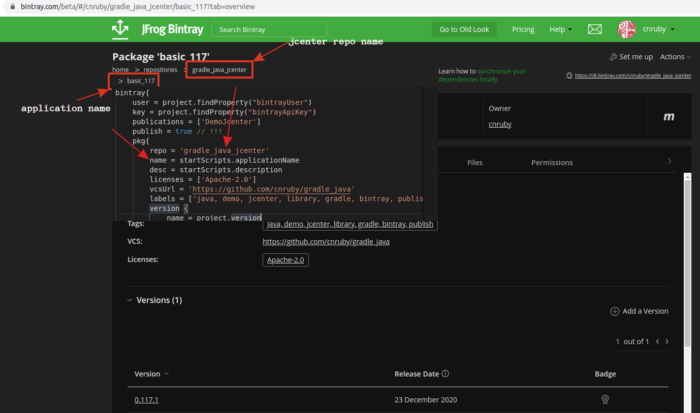
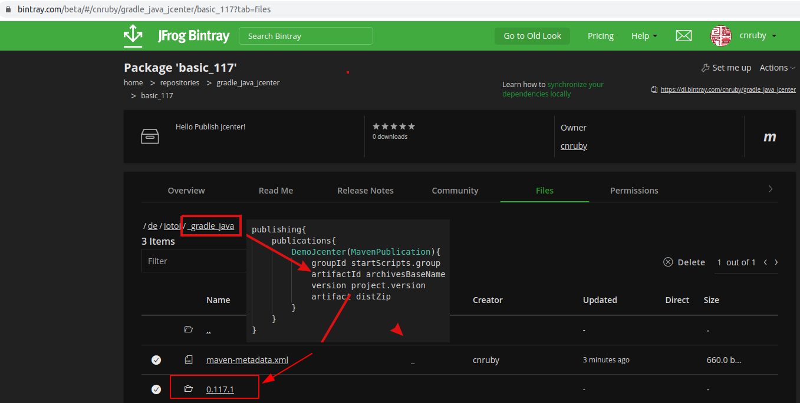
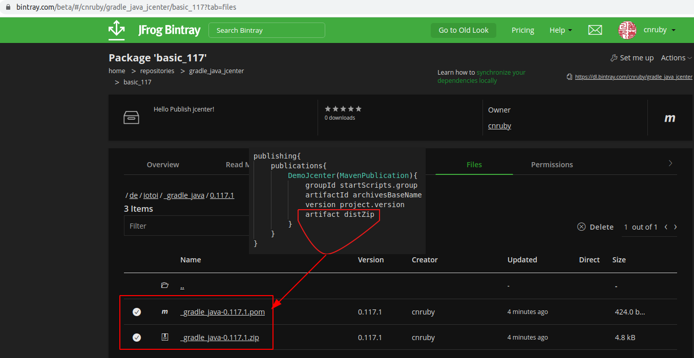

<a href = "https://openjdk.java.net/">

</a>


[](https://ubuntu.com/)
[](https://github.com/shyiko/jabba)
[](https://www.azul.com/downloads/zulu-community/?package=jdk)
[](https://gradle.org/)
[](https://github.com/cnruby/gradle_java/actions?query=workflow%3ACI--basic_117)
[](https://github.com/cnruby/gradle_java/actions)
[](https://app.circleci.com/pipelines/github/cnruby/gradle_java?branch=basic_117)
[ ](https://bintray.com/cnruby/gradle_java_jcenter/basic_117/0.117.2/link)


---


basic_117 v2 Hello Publishing Application!
<h1>Lesson 117: Hello Publishing Application!</h1>

- How to Publish `Java Application` to JCenter


---

- [Keywords](#keywords)
- [Prerequisites](#prerequisites)
- [Create a Gradle Project from GitHub.com](#create-a-gradle-project-from-githubcom)
- [Develop the Java Project](#develop-the-java-project)
  - [add a new gradle properties file](#add-a-new-gradle-properties-file)
  - [add the plugin to the build file `build.gradle`](#add-the-plugin-to-the-build-file-buildgradle)
  - [add a gradle properties file `gradle.properties`](#add-a-gradle-properties-file-gradleproperties)
  - [add configuration to the build file `build.gradle`](#add-configuration-to-the-build-file-buildgradle)
  - [define publishing content to the build file `build.gradle`](#define-publishing-content-to-the-build-file-buildgradle)
  - [configre the jecnter's values](#configre-the-jecnters-values)
- [Publish the Java Application](#publish-the-java-application)
  - [build the Java application](#build-the-java-application)
  - [publish the Java Application to JCenter](#publish-the-java-application-to-jcenter)
  - [Result on JCenter](#result-on-jcenter)
- [Use the published Application](#use-the-published-application)
- [Working Process](#working-process)
- [Download and Use This complete Project](#download-and-use-this-complete-project)
  - [Download the project](#download-the-project)
  - [Usage for the project](#usage-for-the-project)
- [Main's References](#mains-references)
- [Refeneces](#refeneces)


## Keywords
- `Java Application` `Java Project` `gradle bintrayUpload` `publish package` package `publish application`
- Ubuntu Java Gradle gradlew tutorial example Groovy


## Prerequisites
- [install JDK on Ubuntu 20.04](https://github.com/cnruby/gradle_java/blob/basic_101/README.md)
- [install Gradle on Ubuntu 20.04](https://github.com/cnruby/gradle_java/blob/basic_102/README.md)
- [Bintray Account](https://bintray.com/login?forwardedFrom=%2F)
- [Learn "Hello jcenter!"](https://github.com/cnruby/gradle_java/tree/basic_004)
- [Learn "Hello Gradle Properties!"](https://github.com/cnruby/gradle_java/tree/basic_116)


## Create a Gradle Project from GitHub.com

```bash
# DO (open a new terminal)
NEW_APP_ID=117 \
&& git clone https://github.com/cnruby/gradle_java.git ${NEW_APP_ID}_gradle_java \
&& cd ${NEW_APP_ID}_gradle_java
```

```bash
# DO (check the project)
./gradlew -q check
    # >> Result: nothing
```


## Develop the Java Project


### add a new gradle properties file

```bash
# DO (create a new file)
touch ~/jcenter.properties

# DO (edit the file)
nano ~/jcenter.properties
    # FILE (~/jcenter.properties)
    ext {
        bintrayUser = "your_username"
        bintrayApiKey = "your_api_key"
    }
```

### add the plugin to the build file `build.gradle`

```bash
# DO (edit the file "./build.gradle")
nano ./build.gradle
    # FILE (./build.gradle)
    ...
    plugins {
        id 'java'
        id 'application'

        id 'com.jfrog.bintray' version '1.8.5'
        id 'maven-publish'
    }
    ...
```

### add a gradle properties file `gradle.properties`

```bash
# DO (create the file "./gradle.properties")
touch ./gradle.properties

# DO (edit the file "./gradle.properties")
nano ./gradle.properties
    # FILE (./gradle.properties)
    version=0.117.1
```

### add configuration to the build file `build.gradle`
- should change all words with beginning `your`.

```bash
# DO (edit the file "./build.gradle")
nano ./build.gradle
    # FILE (./build.gradle)
    ...
    startScripts {
        applicationName = 'your_app_name'  # can not be the same project name
        group = 'your.group.name'
        sourceCompatibility = JavaVersion.VERSION_11
        description = 'your_description!'
    }
    version = project.findProperty("version")

    apply from: System.getenv("HOME") + "/jcenter.properties"
    ...
```

### define publishing content to the build file `build.gradle`

```bash
# DO (edit the file "./build.gradle")
nano ./build.gradle
    # FILE (./build.gradle)
    ...
    publishing{
        publications{
            DemoJcenter(MavenPublication){
                groupId startScripts.group
                artifactId archivesBaseName
                version project.version
                artifact distZip
            }
        }
    }
```

### configre the jecnter's values
- should change all words with beginning `your`.

```bash
bintray{
    user = project.findProperty("bintrayUser")
    key = project.findProperty("bintrayApiKey")
    publications = ['DemoJcenter']
    publish = true // !!!
    pkg{
        repo = 'your_jcenter_repo'
        name = startScripts.applicationName
        desc = startScripts.description
        licenses = ['Apache-2.0']
        vcsUrl = 'your_github_repo_link'
        labels = ['your labels']
        version {
            name = project.version
            released = new Date()
        }
    }
}
```


## Publish the Java Application

### build the Java application

```bash
./gradlew -q clean build
    # >> Result: nothing
```

### publish the Java Application to JCenter

```bash
# DO (publish the Java Application to JCenter)
./gradlew bintrayUpload
    # >> Result
    > Task :bintrayUpload
    Uploading to https://api.bintray.com/content/cnruby/gradle_java_jcenter/basic_117/0.117.1/de/iotoi/_gradle_java/0.117.1/_gradle_java-0.117.1.zip...
    Uploaded to 'https://api.bintray.com/content/cnruby/gradle_java_jcenter/basic_117/0.117.1/de/iotoi/_gradle_java/0.117.1/_gradle_java-0.117.1.zip'.
    Uploading to https://api.bintray.com/content/cnruby/gradle_java_jcenter/basic_117/0.117.1/de/iotoi/_gradle_java/0.117.1/_gradle_java-0.117.1.pom...
    Uploaded to 'https://api.bintray.com/content/cnruby/gradle_java_jcenter/basic_117/0.117.1/de/iotoi/_gradle_java/0.117.1/_gradle_java-0.117.1.pom'.

    Deprecated Gradle features were used in this build, making it incompatible with Gradle 7.0.
    Use '--warning-mode all' to show the individual deprecation warnings.
    See https://docs.gradle.org/6.7.1/userguide/command_line_interface.html#sec:command_line_warnings

    BUILD SUCCESSFUL in 7s
    8 actionable tasks: 4 executed, 4 up-to-date
```

### Result on JCenter

<div align="right">
 
 
 
</div>


## Use the published Application

```bash
# DO (Download the zip file)
wget https://dl.bintray.com/cnruby/gradle_java_jcenter/de/iotoi/_gradle_java/0.117.1/_gradle_java-0.117.1.zip

# DO (unzip the file)
unzip _gradle_java-0.117.1.zip

# DO (run the java applcation)
./_gradle_java-0.117.1/bin/basic_117
```


## Working Process

```bash
# FOR loop
  # DO (change a code)
  # DO (commit and push the code)
  # DO (build the project)
  ./gradlew -q clean build
  # DO (publish the application)
  ./gradlew bintrayUpload
  # DO (view the jcenter)
  google-chrome https://bintray.com/login?forwardedFrom=%2F
# ENDFOR
```


## Download and Use This complete Project

### Download the project
```bash
# DO (download)
git clone -b basic_117 https://github.com/cnruby/gradle_java.git basic_117
```

### Usage for the project
- [Project--"basic_117"--for--The--Release](https://github.com/cnruby/gradle_java/releases/tag/v0.117.1)


## Main's References
- https://docs.gradle.org/current/userguide/distribution_plugin.html

## Refeneces
- https://jcenter.bintray.com/de/iotoi/demo-jcenter/
- https://dl.bintray.com/cnruby/gradle_java_jcenter/de/iotoi/demo-jcenter/
- https://livebook.manning.com/book/gradle-in-action/
- https://github.com/bintray/bintray-examples
- https://bintray.com/login?forwardedFrom=%2F
- https://github.com/bintray/gradle-bintray-plugin
- https://plugins.gradle.org/plugin/com.jfrog.bintray
- 