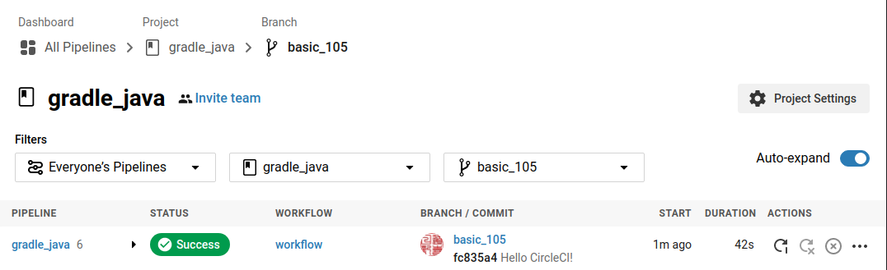
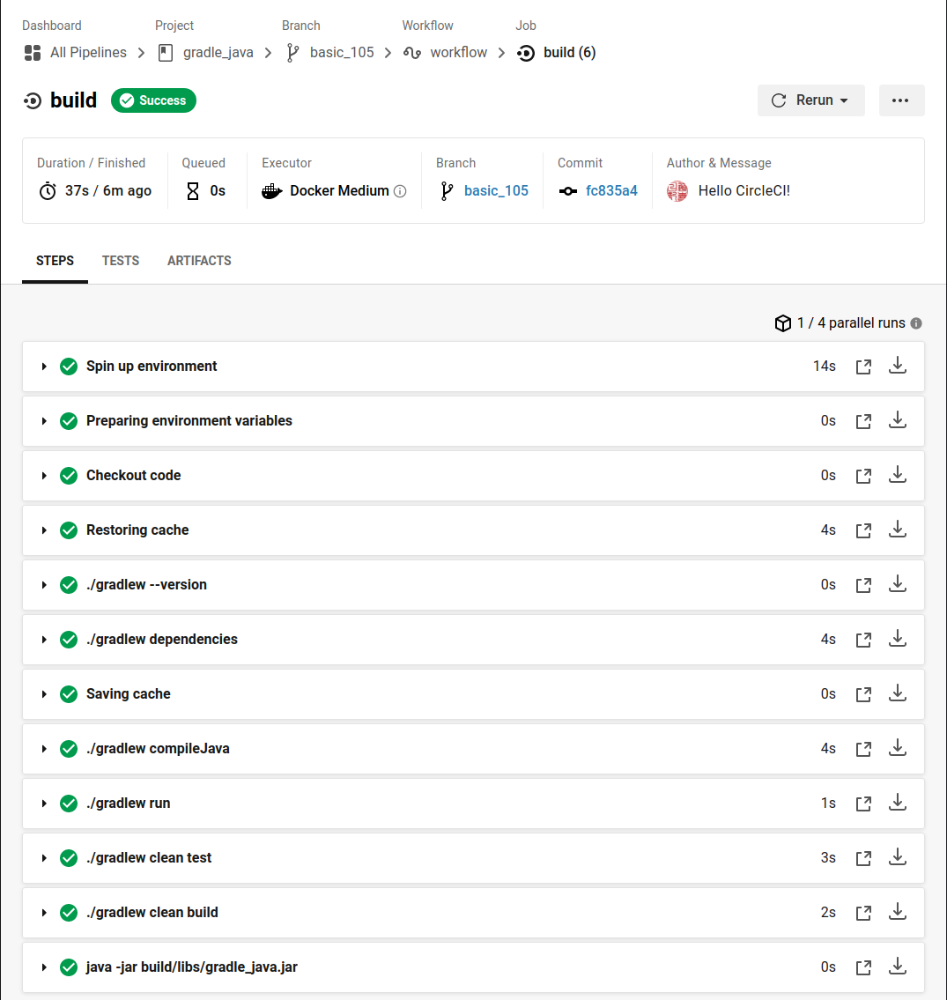

<a href = "https://openjdk.java.net/">

</a>


[-brightgreen)](https://ubuntu.com/)
[](https://gradle.org/)
[](https://app.circleci.com/pipelines/github/cnruby/gradle_java?branch=basic_105)

<h1>Lesson 105: Hello CircleCI!</h1>

- Develop a Java application with Gradle and CI

---

- [Keywords](#keywords)
- [Prerequisites](#prerequisites)
- [Create a Java Application with Gradle](#create-a-java-application-with-gradle)
- [Add the configuration for CI (CircleCI.com)](#add-the-configuration-for-ci-circlecicom)
- [Program the Java application](#program-the-java-application)
  - [change the build file `build.gradle`](#change-the-build-file-buildgradle)
  - [run the Java application](#run-the-java-application)
  - [test the Java application](#test-the-java-application)
  - [build the Java application](#build-the-java-application)
  - [run the Java application with Jar:](#run-the-java-application-with-jar)
- [Go to The CI Website `CircleCI.com`](#go-to-the-ci-website-circlecicom)
- [References](#references)


## Keywords
- `Continuous Integration` CI `Continuous Deployment` CD CircleCI
- Ubuntu Java Gradle tutorial example


## Prerequisites
- [install JDK on Ubuntu 20.04](https://github.com/cnruby/gradle_java/blob/basic_101/README.md)
- [install Gradle on Ubuntu 20.04](https://github.com/cnruby/gradle_java/blob/basic_102/README.md)
- [CircleCI Account](https://circleci.com/vcs-authorize/)


## Create a Java Application with Gradle

```bash
gradle init --project-name gradle_java --type java-application --dsl groovy --test-framework 'junit-jupiter' --package basic_105
```

## Add the configuration for CI (CircleCI.com)

```bash
mkdir .circleci
touch .circleci/config.yml
vi .circleci/config.yml
```

```bash
# config.yml
# Java Gradle CircleCI 2.0 configuration file
#
version: 2
jobs:
  build:
    docker:
      # specify the version you desire here
      # - image: circleci/openjdk:11-jdk
      - image: azul/zulu-openjdk:11

      # - image: circleci/postgres:9.4

    working_directory: ~/repo

    environment:
      # Customize the JVM maximum heap limit
      JVM_OPTS: -Xmx3200m
      TERM: dumb

    steps:
      - checkout

      # Download and cache dependencies
      - restore_cache:
          keys:
            - v1-dependencies-{{ checksum "build.gradle" }}
            # fallback to using the latest cache if no exact match is found
            - v1-dependencies-

      # about Gradle
      - run: ./gradlew --version

      # project libraries
      - run: ./gradlew dependencies

      - save_cache:
          paths:
            - ~/.gradle
          key: v1-dependencies-{{ checksum "build.gradle" }}

      # compile application
      - run: ./gradlew compileJava

      # run application
      - run: ./gradlew run
      
      # run application tests
      - run: ./gradlew clean test

      # build application
      - run: ./gradlew clean build

      # run application Jar
      - run: java -jar build/libs/gradle_java.jar
```


## Program the Java application

### change the build file `build.gradle`

```bash
# build.gradle
...
ext {
    javaMain = "basic_105.App"
}

application {
    // Define the main class for the application.
    mainClassName = javaMain
}

jar {
    manifest {
        attributes(
                "Main-Class": javaMain
        )
    }
}
...
```

### run the Java application

```bash
./gradlew run
#./gradlew :run
```

Result:

```bash
> Task :run
Hello world.

BUILD SUCCESSFUL in 422ms
2 actionable tasks: 2 executed
```

### test the Java application

```bash
./gradlew clean test
```

### build the Java application
 
```bash
./gradlew clean build
```

### run the Java application with Jar:

```bash
java -jar build/libs/gradle_java.jar
```

Result:

```bash
Hello world.
```

## Go to The CI Website `CircleCI.com`





## References
- https://circleci.com/
- https://circleci.com/docs/2.0/status-badges/
- https://github.com/wavesoftware/docker-circleci-zulujdk
- https://circleci.com/docs/2.0/language-java/