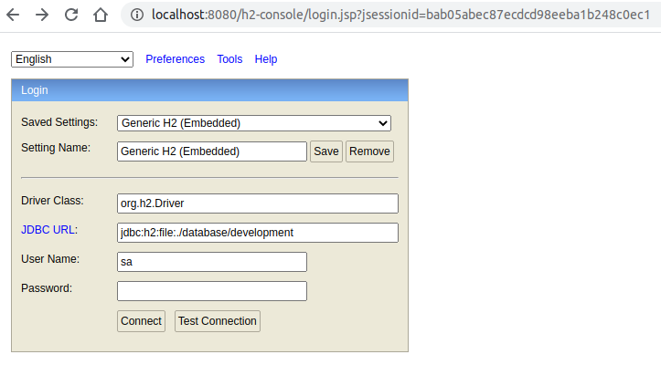
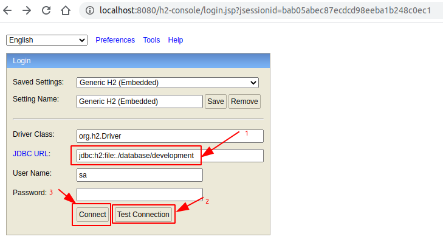
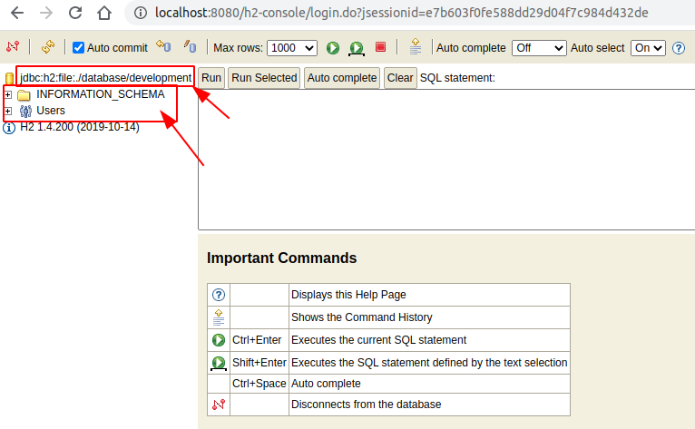
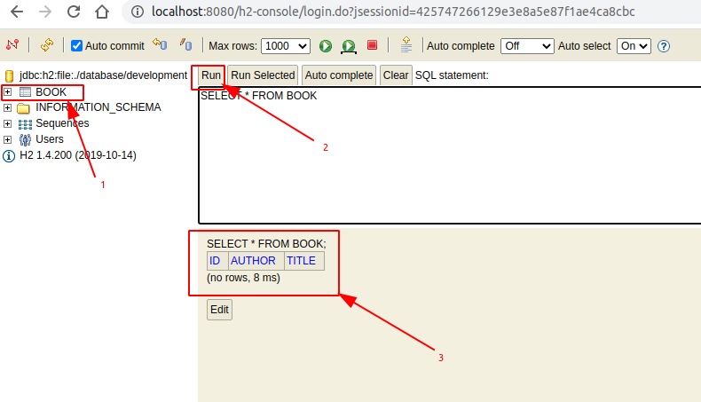
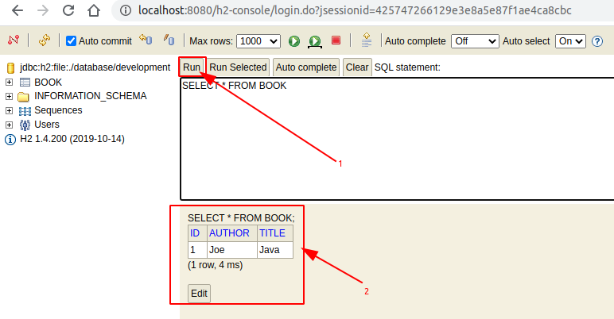

<a href = "https://openjdk.java.net/">

</a>

[](https://ubuntu.com/)
[](https://github.com/shyiko/jabba)
[](https://gradle.org/)
[](https://www.azul.com/downloads/zulu-community/?package=jdk)
[](https://www.jetbrains.com/de-de/idea/download/#section=linux)
[](https://www.docker.com/)
[](https://app.circleci.com/pipelines/github/cnruby/gradle_java?branch=basic_210)


---

Unit 210: Hello H2 Console!
<h1>Unit 210: Hello H2 Console!</h1>

- How to Understand Database h2 Console
- How to Understand JPA and Database h2


---


- [Keywords](#keywords)
- [Prerequisites](#prerequisites)
- [Create A New Java Web App](#create-a-new-java-web-app)
  - [DO (create a new project)](#do-create-a-new-project)
  - [DO (check the project)](#do-check-the-project)
- [Configure h2 file database and its console for spring boot](#configure-h2-file-database-and-its-console-for-spring-boot)
  - [DO (edit the spring property file)](#do-edit-the-spring-property-file)
  - [DO (check the project)](#do-check-the-project-1)
- [View H2 Database by Browser](#view-h2-database-by-browser)
  - [DO (open a new terminal to start hotcode)](#do-open-a-new-terminal-to-start-hotcode)
  - [DO (open a new terminal to run the web application)](#do-open-a-new-terminal-to-run-the-web-application)
  - [DO (open a new terminal to browse the h2 console)](#do-open-a-new-terminal-to-browse-the-h2-console)
  - [DO (connect the h2 console)](#do-connect-the-h2-console)
  - [DO (show the h2 database)](#do-show-the-h2-database)
- [View Table `BOOK` on h2 file database](#view-table-book-on-h2-file-database)
  - [DO (edit the spring property file)](#do-edit-the-spring-property-file-1)
  - [DO (show the record with terminal)](#do-show-the-record-with-terminal)
  - [DO (view the table `BOOK` on h2 console)](#do-view-the-table-book-on-h2-console)
- [View Records on Table `BOOK`](#view-records-on-table-book)
  - [DO (insert a record)](#do-insert-a-record)
  - [DO (show the record with browser)](#do-show-the-record-with-browser)
  - [DO (show the record with h2-console-browser)](#do-show-the-record-with-h2-console-browser)
  - [DO (show the record with terminal)](#do-show-the-record-with-terminal-1)
- [References](#references)
- [References for tools](#references-for-tools)


## Keywords
- `Spring Boot` `Web Application` database h2 Console REST API
- `Java JDK` `IntelliJ CE` CircleCI CI
- tutorial example Ubuntu Gradle jabba JDK Java JVM


## Prerequisites
- [install JDK on Ubuntu 20.04](https://github.com/cnruby/gradle_java/blob/basic_101/README.md)
- [install Gradle on Ubuntu 20.04](https://github.com/cnruby/gradle_java/blob/basic_102/README.md)
- [IntelliJ IDEA Community](https://www.jetbrains.com/de-de/idea/download/#section=linux)
- [install Docker on Ubuntu](https://docs.docker.com/engine/install/ubuntu/) OR [Using Docker](https://github.com/cnruby/gradle_java/tree/basic_002)
- [CircleCI Account](https://circleci.com/vcs-authorize/)


## Create A New Java Web App

### DO (create a new project)
```bash
EXISTING_APP_ID=209 && NEW_APP_ID=210 \
&& git clone -b basic_${EXISTING_APP_ID} https://github.com/cnruby/gradle_java.git ${NEW_APP_ID}_gradle_java \
&& cd ${NEW_APP_ID}_gradle_java
```

### DO (check the project)
```bash
./gradlew -q check
```
```bash
    # >> Result: nothing
```


## Configure h2 file database and its console for spring boot

### DO (edit the spring property file)
```bash
nano ./src/main/resources/application.properties
```
```bash
# FILE (application.properties)
spring.main.banner-mode=off
spring.main.log-startup-info=off
web.app.name=Hello h2 console
logging.level.root=WARN

# H2 Web Console (H2ConsoleProperties)
# Defualt Configuration
# spring.h2.console.enabled=true
# spring.h2.console.settings.web-allow-others=true
# spring.h2.console.path=/h2-console

# DATASOURCE (DataSourceAutoConfiguration & DataSourceProperties)
spring.datasource.driver-class-name=org.h2.Driver
spring.datasource.username=sa
spring.datasource.password=
spring.datasource.url = jdbc:h2:file:./database/development;AUTO_SERVER=TRUE

# JPA (JpaBaseConfiguration)
spring.jpa.database-platform = org.hibernate.dialect.H2Dialect
spring.jpa.open-in-view = true
```

### DO (check the project)
```bash
./gradlew -q check
```
```bash
    # >> Result: nothing
```


## View H2 Database by Browser 

### DO (open a new terminal to start hotcode)
```bash
./gradlew -q bootJar --continuous
```
```bash
    # >> Result
    Waiting for changes to input files of tasks... (ctrl-d to exit)
    <-------------> 0% WAITING
    > IDLE
```

### DO (open a new terminal to run the web application)
```bash
./gradlew -q bootRun
```
```bash
    # Result
    <==========---> 83% EXECUTING [35s]
    > :bootRun   
```

### DO (open a new terminal to browse the h2 console)
```bash
google-chrome http://localhost:8080/h2-console
```


### DO (connect the h2 console)
```bash
# DO (enter "jdbc:h2:file:./database/development;AUTO_SERVER=TRUE")
# DO (click the button 'Test Connection')
# DO (click the button 'Connect')
```



### DO (show the h2 database)
- !!! NO Table `BOOK` exists.



## View Table `BOOK` on h2 file database

### DO (edit the spring property file)
```bash
nano ./src/main/resources/application.properties
```
```bash
# FILE (application.properties)
...
# !!! (h2 file database and its tables and records exist still after Spring Boot restart)
spring.jpa.open-in-view = true
spring.jpa.generate-ddl = true
```

### DO (show the record with terminal)
```bash
curl --no-progress-meter http://localhost:8080/api/books | json_pp
```
```bash
    # Result
    []
```

### DO (view the table `BOOK` on h2 console)
- !!! NO Records exists on table `BOOK`
```bash
google-chrome http://localhost:8080/h2-console
```

```bash
# DO (browse the h2 console)
# DO (connect the h2 console)
# DO (click 'BOOK')
# DO (click 'Run')
```




## View Records on Table `BOOK`

### DO (insert a record)
```bash
curl --no-progress-meter \
    -H "Content-Type: application/json" \
    -X POST -d '{"title":"Java","author":"Joe"}' \
    localhost:8080/api/books | json_pp
```

### DO (show the record with browser)
```bash
google-chrome http://localhost:8080/h2-console
```

### DO (show the record with h2-console-browser)
```bash
# DO (click 'Run')
```



### DO (show the record with terminal)
```bash
curl --no-progress-meter http://localhost:8080/api/books | json_pp
```
```bash
    # Result
    [
        {
            "author" : "Joe",
            "id" : 1,
            "title" : "Java"
        }
    ]
```


## References
- https://gist.github.com/memory-lovers/4132241df38456642ad888634caee5c6
- https://github.com/DeadLion/spring-boot-samples/blob/master/application.properties.md
- https://dzone.com/articles/run-the-rest-version-of-spring-petclinic-with-angu
- https://dimitr.im/loading-initial-data-with-spring
- https://docs.spring.io/spring-boot/docs/1.2.0.M1/reference/html/howto-database-initialization.html
- https://www.baeldung.com/spring-boot-data-sql-and-schema-sql
- https://stackoverflow.com/questions/38040572/spring-boot-loading-initial-data
- https://docs.microsoft.com/de-de/azure/developer/java/spring-framework/configure-spring-data-jpa-with-azure-mysql
- https://www.xspdf.com/resolution/20463098.html
- https://docs.spring.io/spring-boot/docs/current/reference/html/appendix-application-properties.html
- https://javabydeveloper.com/spring-boot-loading-initial-data/
- https://stackoverflow.com/questions/53464632/application-properties-to-application-yml-spring-boot
- https://github.com/cesarsicas/spring-blog
- https://github.com/spring-projects/spring-boot/issues/20920


## References for tools
- [Add a copy to clipboard button in a GitHub](https://github.com/zenorocha/codecopy#install)
