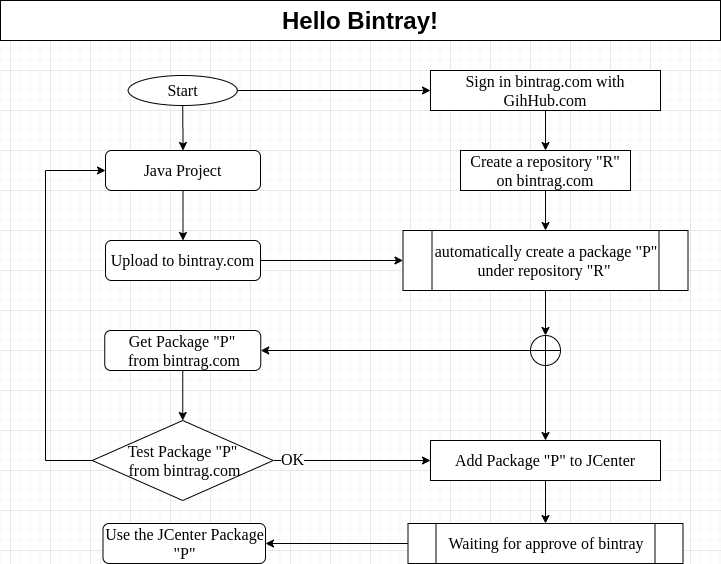

<a href = "https://openjdk.java.net/">

</a>


[](https://ubuntu.com/)
[](https://github.com/shyiko/jabba)
[](https://www.azul.com/downloads/zulu-community/?package=jdk)
[](https://gradle.org/)
[](https://app.circleci.com/pipelines/github/cnruby/gradle_java?branch=basic_118)
[](https://github.com/cnruby/gradle_java/actions)


---

basic_119 Hello Bintray!
<h1>Lesson 119: Hello Bintray!</h1>

- Use Your Own Java Library from bintray.com
- Show mutual relations between bintray.com and JCenter


---


- [Keywords](#keywords)
- [Prerequisites](#prerequisites)
- [Map for JCenter and bintray.com](#map-for-jcenter-and-bintraycom)
- [Create a Java Project from `GitHub.com`](#create-a-java-project-from-githubcom)
- [Method 1: Use and Test The Library from the Website `bintrag.com`](#method-1-use-and-test-the-library-from-the-website-bintragcom)
  - [download the library package from bintray.com](#download-the-library-package-from-bintraycom)
  - [change the build file `build.gradle` for the subproject "app"](#change-the-build-file-buildgradle-for-the-subproject-app)
- [Method 2: Use The Library from the `JCenter`](#method-2-use-the-library-from-the-jcenter)
- [Method 3: Use a Library Package from Maven Local](#method-3-use-a-library-package-from-maven-local)
- [Download and Use This complete Project](#download-and-use-this-complete-project)
- [Main's Referenecs](#mains-referenecs)
- [Referenecs](#referenecs)


## Keywords
- `Java Multi-Project` `gradle projects` `own java library` bintray.com jcenter
- Ubuntu Java Gradle gradlew tutorial example library


## Prerequisites
- [install JDK on Ubuntu 20.04](https://github.com/cnruby/gradle_java/blob/basic_101/README.md)
- [install Gradle on Ubuntu 20.04](https://github.com/cnruby/gradle_java/blob/basic_102/README.md)
- [Bintray Account](https://bintray.com/login?forwardedFrom=%2F)


## Map for JCenter and bintray.com




## Create a Java Project from `GitHub.com`

```bash
# DO (open a new terminal)
EXISTING_APP_ID=118 && NEW_APP_ID=119 \
&& git clone -b basic_${EXISTING_APP_ID}  \
    https://github.com/cnruby/gradle_java.git ${NEW_APP_ID}_gradle_java \
&& cd ${NEW_APP_ID}_gradle_java
```

```bash
# DO (check the project)
./gradlew check
```


## Method 1: Use and Test The Library from the Website `bintrag.com`


### download the library package from bintray.com

```bash
# DO (make a folder "./libs")
mkdir libs

# DO (Download the Bintray.com Library Package)
wget -P ./libs/ https://dl.bintray.com/cnruby/gradle_java_jcenter/de/iotoi/basic_118/0.118.1/basic_118-0.118.1.jar
```

### change the build file `build.gradle` for the subproject "app"

```bash
# DO (edit the file ./app/build.gradle)
nano ./app/build.gradle
    # FILE ()
    ...
    dependencies {
        implementation files("${rootProject.projectDir}/libs/basic_118-0.118.1.jar")
    }
```

```bash
# DO (run the application with the library)
./gradlew -q app:run

    # >> Result
    Hello world.
```


## Method 2: Use The Library from the `JCenter`

```bash
# DO (View your JCenter Library Package)
google-chrome https://jcenter.bintray.com/de/iotoi/basic_118/0.118.1
```

```bash
# DO (edit the file ./app/build.gradle)
nano ./app/build.gradle
    # FILE (./app/build.gradle)
    ...
    dependencies {
        implementation 'de.iotoi:basic_118:0.118.1
    }
```

```bash
# DO (run the application with the library)
/gradlew -q app:run
    # >> Result
    Hello world.
```


## Method 3: Use a Library Package from Maven Local

```bash
# DO (publish to Local System)
./gradlew clean build publishToMavenLocal

# DO (view the library package)
ls -al ./.m2/repository/de/iotoi/basic_119/0.119.1/basic_119-0.119.1.jar 
```

```bash
# DO (edit the file ./app/build.gradle)
nano ./app/build.gradle
    # FILE (./app/build.gradle)
    ...
    dependencies {
        implementation files(System.getenv("HOME") + "/.m2/repository/de/iotoi/basic_119/0.119.1/basic_119-0.119.1.jar") 
    }
```

```bash
# DO (run the application)
./gradlew -q app:run
```


## Download and Use This complete Project

```bash
# Download
git clone -b basic_119 https://github.com/cnruby/gradle_java.git basic_119
```

```bash
# Usage for the project
google-chrome https://github.com/cnruby/gradle_java/releases/tag/v0.119.1
```


## Main's Referenecs
- http://andresalmiray.com/publishing-artifacts-to-maven-central-with-bintray-gradle/


## Referenecs
- https://docs.github.com/en/free-pro-team@latest/actions/learn-github-actions/introduction-to-github-actions
- https://medium.com/@shanemyrick/publishing-to-github-packages-with-gradle-and-github-actions-4ad842634c4e
- https://www.flowsquad.io/blog/2020-05-29-devops-mit-github-teil-1-github-packages-mit-gradle/
- https://docs.github.com/en/free-pro-team@latest/packages/guides/configuring-gradle-for-use-with-github-packages
- https://docs.github.com/en/free-pro-team@latest/actions/guides/publishing-java-packages-with-gradle
- https://medium.com/@anitaa_1990/6-easy-steps-to-upload-your-android-library-to-bintray-jcenter-59e6030c8890
- https://www.jfrog.com/confluence/display/BT/Central+Repositories
- https://stackoverflow.com/questions/42035918/there-is-no-add-to-jcenter-button-in-https-bintray-com
- https://stackoverflow.com/questions/1078524/how-to-specify-the-location-with-wget
- https://stackoverflow.com/questions/20700053/how-to-add-local-jar-file-dependency-to-build-gradle-file
- https://stackoverflow.com/questions/17262856/how-to-set-the-project-name-group-version-plus-source-target-compatibility-in
- https://proandroiddev.com/tip-work-with-third-party-projects-locally-with-gradle-961d6c9efb02
- https://stackoverflow.com/questions/59838/how-can-i-check-if-a-directory-exists-in-a-bash-shell-script