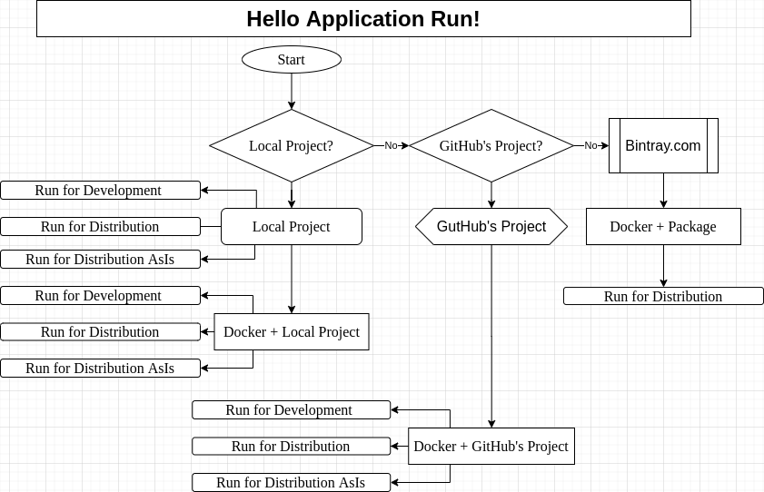

<a href = "https://openjdk.java.net/">

</a>


[](https://ubuntu.com/)
[](https://github.com/shyiko/jabba)
[](https://www.azul.com/downloads/zulu-community/?package=jdk)
[](https://gradle.org/)
[](https://github.com/cnruby/gradle_java/actions)
[](https://app.circleci.com/pipelines/github/cnruby/gradle_java?branch=basic_121)
[ ](https://bintray.com/cnruby/gradle_java_jcenter/basic_121/0.121.2/link)


---


basic_121 Hello Application Run!
<h1>Lesson 121: Hello Application Run!</h1>

- How to Run `Java Application` on Local OS
- How to Run `Java Application` on Docker


---

- [Keywords](#keywords)
- [Prerequisites](#prerequisites)
- [Map for this Project](#map-for-this-project)
- [Create a Gradle Project from GitHub.com](#create-a-gradle-project-from-githubcom)
- [Run the Java Project for Develop](#run-the-java-project-for-develop)
  - [Run this project as a JVM application](#run-this-project-as-a-jvm-application)
  - [Run this project as a distribution](#run-this-project-as-a-distribution)
  - [Run this project as a distribution as-is](#run-this-project-as-a-distribution-as-is)
- [Run the Java Local's Project on Docker](#run-the-java-locals-project-on-docker)
  - [Run this project on Docker](#run-this-project-on-docker)
  - [Run this project as a distribution on Docker](#run-this-project-as-a-distribution-on-docker)
  - [Run this project as a distribution as-is on Docker](#run-this-project-as-a-distribution-as-is-on-docker)
  - [Run all Dockerfiles about Local's Project](#run-all-dockerfiles-about-locals-project)
- [Run the Java GitHub's Project on Docker](#run-the-java-githubs-project-on-docker)
  - [Run this GitHub's project on Docker](#run-this-githubs-project-on-docker)
  - [Run this GitHub's project as a distribution on Docker](#run-this-githubs-project-as-a-distribution-on-docker)
  - [Run this GitHub's project as a distribution as-is on Docker](#run-this-githubs-project-as-a-distribution-as-is-on-docker)
  - [Run all Dockerfiles about GitHub's Project](#run-all-dockerfiles-about-githubs-project)
- [Run the Java published Application on Docker](#run-the-java-published-application-on-docker)
- [Download and Use This complete Project](#download-and-use-this-complete-project)
  - [Download the project](#download-the-project)
  - [Usage for the project](#usage-for-the-project)
- [Main's References](#mains-references)
- [References](#references)


## Keywords
- `Java Application` `Java Project` docker `run application`
- Ubuntu Java Gradle gradlew tutorial example Groovy
- `publish package` package `publish application`


## Prerequisites
- [install JDK on Ubuntu 20.04](https://github.com/cnruby/gradle_java/blob/basic_101/README.md)
- [install Gradle on Ubuntu 20.04](https://github.com/cnruby/gradle_java/blob/basic_102/README.md)


## Map for this Project



## Create a Gradle Project from GitHub.com

```bash
# DO (open a new terminal)
EXISTING_APP_ID=117 && NEW_APP_ID=121 \
&& git clone -b basic_${EXISTING_APP_ID} https://github.com/cnruby/gradle_java.git ${NEW_APP_ID}_gradle_java \
&& cd ${NEW_APP_ID}_gradle_java
```

```bash
# DO (check the project)
./gradlew -q check
    # >> Result: nothing
```


## Run the Java Project for Develop

### Run this project as a JVM application
```bash
# DO (run this project as a JVM application)
./gradlew -q run
    # >> Result
    Hello world.
```

### Run this project as a distribution
```bash
# DO (delete the build directory)
# DO (assemble and tests this project)
./gradlew -q clean build
    # >> Result: nothing

# DO (unzip the distribution)
unzip build/distributions/_gradle_java-0.121.1.zip

# DO (run this project as a distribution)
./_gradle_java-0.121.1/bin/_gradle_java
    # >> Result
    Hello world.
```

### Run this project as a distribution as-is
```bash
# DO (install the project as a distribution as-is)
./gradlew -q clean installDist
    # >> Result: nothing

# DO (run this project as a distribution as-is)
./build/install/_gradle_java/bin/_gradle_java
    # >> Result
    Hello world.
```


## Run the Java Local's Project on Docker

### Run this project on Docker

```bash
# DO (make a folder for docker build files)
mkdir Dockerfiles

# DO (create a docker build file)
touch ./Dockerfiles/src.project.Dockerfile

# DO (edit the docker build file)
nano ./Dockerfiles/src.project.Dockerfile

    # FILE (./Dockerfiles/src.project.Dockerfile)
    FROM gradle:6.7.1-jdk11 AS gradle_build
    COPY --chown=gradle:gradle . /home/gradle/src
    COPY --chown=gradle:gradle ./jcenter.properties.sample /root/jcenter.properties
    WORKDIR /home/gradle/src
    RUN gradle check --no-daemon

    FROM azul/zulu-openjdk-alpine:11.0.7
    RUN apk update && apk add bash
    WORKDIR /app
    COPY --from=gradle_build /home/gradle/src/. /app/.
    COPY --from=gradle_build /root/jcenter.properties /root/jcenter.properties
    CMD ["./gradlew", "run"]
```

```bash
# DO (create a docker image)
docker build --file Dockerfiles/src.project.Dockerfile --tag=121_gradle_java .

# DO (run a docker container)
docker run 121_gradle_java
    # >> Result
    Downloading https://services.gradle.org/distributions/gradle-6.7.1-bin.zip
    .........10%..........20%..........30%..........40%..........50%.........60%..........70%..........80%..........90%..........100%

    Welcome to Gradle 6.7.1!

    Here are the highlights of this release:
    - File system watching is ready for production use
    - Declare the version of Java your build requires
    - Java 15 support

    For more details see https://docs.gradle.org/6.7.1/release-notes.html

    Starting a Gradle Daemon (subsequent builds will be faster)
    > Task :compileJava
    > Task :processResources NO-SOURCE
    > Task :classes

    > Task :run
    Hello world.

    BUILD SUCCESSFUL in 1m 12s
    2 actionable tasks: 2 executed
```

### Run this project as a distribution on Docker

```bash
# DO (create a docker build file)
touch ./Dockerfiles/src.dist.Dockerfile

# DO (edit the docker build file)
nano ./Dockerfiles/src.dist.Dockerfile

    # FILE (./Dockerfiles/src.dist.Dockerfile)
    FROM gradle:6.7.1-jdk11 AS gradle_build
    COPY --chown=gradle:gradle . /home/gradle/src
    COPY --chown=gradle:gradle ./jcenter.properties.sample /root/jcenter.properties
    WORKDIR /home/gradle/src
    RUN gradle clean build --no-daemon
    RUN rm -rf ./_gradle_java-0.121.1
    RUN unzip build/distributions/_gradle_java-0.121.1.zip

    FROM azul/zulu-openjdk-alpine:11.0.7-jre
    RUN apk update && apk add bash
    WORKDIR /app
    COPY --from=gradle_build /home/gradle/src/_gradle_java-0.121.1/ /app/
    CMD ["./bin/_gradle_java"]
```

```bash
# DO (create a docker image)
docker build --file Dockerfiles/src.dist.Dockerfile --tag=121_gradle_java .

# DO (run a docker container)
docker run 121_gradle_java
    # >> Result
    Hello world.
```

### Run this project as a distribution as-is on Docker

```bash
# DO (create a docker build file)
touch ./Dockerfiles/src.distAsIs.Dockerfile

# DO (edit the docker build file)
nano ./Dockerfiles/src.distAsIs.Dockerfile

    # FILE (./Dockerfiles/src.distAsIs.Dockerfile)
    FROM gradle:6.7.1-jdk11 AS gradle_build
    COPY --chown=gradle:gradle . /home/gradle/src
    COPY --chown=gradle:gradle ./jcenter.properties.sample /root/jcenter.properties
    WORKDIR /home/gradle/src
    RUN gradle clean installDist --no-daemon

    FROM azul/zulu-openjdk-alpine:11.0.7-jre
    RUN apk update && apk add bash
    WORKDIR /app
    COPY --from=gradle_build /home/gradle/src/build/install/_gradle_java/ /app/
    CMD ["./bin/_gradle_java"]
```

```bash
# DO (create a docker image)
docker build --file Dockerfiles/src.distAsIs.Dockerfile --tag=121_gradle_java .

# DO (run a docker container)
docker run 121_gradle_java
    # >> Result
    Hello world.
```

### Run all Dockerfiles about Local's Project

```bash
# DO (create a docker file)
touch ./src.docker-compose.yml

# DO (edit the docker file)
nano ./src.docker-compose.yml

    # FILE (./src.docker-compose.yml)
    version: "3.7"
    services:
        src_disk_gradle_java:
            build:
                context: .
                dockerfile: Dockerfiles/src.dist.Dockerfile
        src_disk_as_is_gradle_java:
            build:
                context: .
                dockerfile: Dockerfiles/src.distAsIs.Dockerfile
        src_project_gradle_java:
            build:
                context: .
                dockerfile: Dockerfiles/src.project.Dockerfile

        alpine:
            image: "alpine"
```

```bash
# DO (build or rebuild services)
docker-compose --file=./src.docker-compose.yml build

# DO (create and start containers)
docker-compose --file=./src.docker-compose.yml up --remove-orphans
    # >> Result
    Removing orphan container "121_gradle_java_gradle_java_1"
    Starting 121_gradle_java_src_project_gradle_java_1    ... done
    Starting 121_gradle_java_src_disk_as_is_gradle_java_1 ... done
    Starting 121_gradle_java_alpine_1                     ... done
    Starting 121_gradle_java_src_disk_gradle_java_1       ... done
    Attaching to 121_gradle_java_src_disk_as_is_gradle_java_1, 121_gradle_java_src_project_gradle_java_1, 121_gradle_java_src_disk_gradle_java_1, 121_gradle_java_alpine_1
    src_disk_as_is_gradle_java_1  | Hello world.
    src_disk_gradle_java_1        | Hello world.
    src_project_gradle_java_1     | Starting a Gradle Daemon, 1 incompatible and 2 stopped Daemons could not be reused, use --status for details
    121_gradle_java_src_disk_as_is_gradle_java_1 exited with code 0
    121_gradle_java_src_disk_gradle_java_1 exited with code 0
    121_gradle_java_alpine_1 exited with code 0
    src_project_gradle_java_1     | > Task :compileJava UP-TO-DATE
    src_project_gradle_java_1     | > Task :processResources NO-SOURCE
    src_project_gradle_java_1     | > Task :classes UP-TO-DATE
    src_project_gradle_java_1     | 
    src_project_gradle_java_1     | > Task :run
    src_project_gradle_java_1     | Hello world.
    src_project_gradle_java_1     | 
    src_project_gradle_java_1     | BUILD SUCCESSFUL in 11s
    src_project_gradle_java_1     | 2 actionable tasks: 1 executed, 1 up-to-date
    121_gradle_java_src_project_gradle_java_1 exited with code 0
```


## Run the Java GitHub's Project on Docker

### Run this GitHub's project on Docker

```bash
# DO (create a docker build file)
touch ./Dockerfiles/github.project.Dockerfile

# DO (edit the docker build file)
nano ./Dockerfiles/github.project.Dockerfile

    # FILE (./Dockerfiles/github.project.Dockerfile)
    FROM gradle:6.7.1-jdk11 AS gradle_build
    RUN git clone -b basic_110 https://github.com/cnruby/gradle_java.git /home/gradle/src/
    RUN chown -R gradle:gradle /home/gradle/src
    WORKDIR /home/gradle/src
    RUN gradle check --no-daemon

    FROM azul/zulu-openjdk-alpine:11.0.7
    RUN apk update && apk add bash
    WORKDIR /app
    COPY --from=gradle_build /home/gradle/src/. /app/.
    RUN ls -al /app/
    CMD ["./gradlew", "run"]
```

```bash
# DO (create a docker image)
docker build --file Dockerfiles/github.project.Dockerfile --tag=121_gradle_java .

# DO (run a docker container)
docker run 121_gradle_java
    # >> Result
    Downloading https://services.gradle.org/distributions/gradle-6.7.1-bin.zip
    .........10%..........20%..........30%..........40%..........50%.........60%..........70%..........80%..........90%..........100%

    Welcome to Gradle 6.7.1!

    Here are the highlights of this release:
    - File system watching is ready for production use
    - Declare the version of Java your build requires
    - Java 15 support

    For more details see https://docs.gradle.org/6.7.1/release-notes.html

    Starting a Gradle Daemon (subsequent builds will be faster)
    > Task :compileJava
    > Task :processResources NO-SOURCE
    > Task :classes

    > Task :run
    Hello world.

    BUILD SUCCESSFUL in 1m 5s
    2 actionable tasks: 2 executed
```

### Run this GitHub's project as a distribution on Docker

```bash
# DO (create a docker build file)
touch ./Dockerfiles/github.dist.Dockerfile

# DO (edit the docker build file)
nano ./Dockerfiles/github.dist.Dockerfile

    # FILE (./Dockerfiles/github.dist.Dockerfile)
    FROM gradle:6.7.1-jdk11 AS gradle_build
    RUN git clone -b basic_110 https://github.com/cnruby/gradle_java.git /home/gradle/src/
    RUN chown -R gradle:gradle /home/gradle/src
    WORKDIR /home/gradle/src
    RUN gradle clean build installDist --no-daemon
    RUN rm -rf /home/gradle/src/_gradle_java-0.121.1
    RUN unzip /home/gradle/src/build/distributions/_gradle_java.zip

    FROM azul/zulu-openjdk-alpine:11.0.7
    RUN apk update && apk add bash
    WORKDIR /app
    COPY --from=gradle_build /home/gradle/src/_gradle_java/ /app/
    CMD ["./bin/basic_110"]
```

```bash
# DO (create a docker image)
docker build --file Dockerfiles/github.dist.Dockerfile --tag=121_gradle_java .

# DO (run a docker container)
docker run 121_gradle_java
    # >> Result
    Hello world.
```

### Run this GitHub's project as a distribution as-is on Docker

```bash
# DO (create a docker build file)
touch ./Dockerfiles/github.distAsIs.Dockerfile

# DO (edit the docker build file)
nano ./Dockerfiles/github.distAsIs.Dockerfile

    # FILE (./Dockerfiles/github.distAsIs.Dockerfile)
    FROM gradle:6.7.1-jdk11 AS gradle_build
    RUN git clone -b basic_110 https://github.com/cnruby/gradle_java.git /home/gradle/src/
    RUN chown -R gradle:gradle /home/gradle/src
    WORKDIR /home/gradle/src
    RUN gradle clean build installDist --no-daemon

    FROM azul/zulu-openjdk-alpine:11.0.7
    RUN apk update && apk add bash
    WORKDIR /app
    COPY --from=gradle_build /home/gradle/src/build/install/_gradle_java/ /app/
    RUN ls -al /app/bin
    CMD ["./bin/basic_110"]
```

```bash
# DO (create a docker image)
docker build --file Dockerfiles/github.distAsIs.Dockerfile --tag=121_gradle_java .

# DO (run a docker container)
docker run 121_gradle_java
    # >> Result
    Hello world.
```

### Run all Dockerfiles about GitHub's Project

```bash
# DO (create a docker file)
touch ./github.docker-compose.yml

# DO (edit the docker file)
nano ./github.docker-compose.yml

    # FILE (./github.docker-compose.yml)
    version: "3.7"
    services:
        github_disk_gradle_java:
            build:
                context: .
                dockerfile: Dockerfiles/github.dist.Dockerfile
        github_disk_as_is_gradle_java:
            build:
                context: .
                dockerfile: Dockerfiles/github.distAsIs.Dockerfile
        github_project_gradle_java:
            build:
                context: .
                dockerfile: Dockerfiles/github.project.Dockerfile

        alpine:
            image: "alpine"
```

```bash
# DO (build or rebuild services)
docker-compose --file=./github.docker-compose.yml build

# DO (create and start containers)
docker-compose --file=./github.docker-compose.yml up --remove-orphans
    # >> Result
    Removing orphan container "121_gradle_java_src_disk_as_is_gradle_java_1"
    Removing orphan container "121_gradle_java_src_project_gradle_java_1"
    Removing orphan container "121_gradle_java_src_disk_gradle_java_1"
    Starting 121_gradle_java_alpine_1                        ... done
    Creating 121_gradle_java_github_disk_gradle_java_1       ... done
    Creating 121_gradle_java_github_project_gradle_java_1    ... done
    Creating 121_gradle_java_github_disk_as_is_gradle_java_1 ... done
    Attaching to 121_gradle_java_alpine_1, 121_gradle_java_github_disk_gradle_java_1, 121_gradle_java_github_disk_as_is_gradle_java_1, 121_gradle_java_github_project_gradle_java_1
    github_disk_gradle_java_1        | Hello world.
    121_gradle_java_alpine_1 exited with code 0
    github_disk_as_is_gradle_java_1  | Hello world.
    github_project_gradle_java_1     | Downloading https://services.gradle.org/distributions/gradle-6.7.1-bin.zip
    121_gradle_java_github_disk_gradle_java_1 exited with code 0
    121_gradle_java_github_disk_as_is_gradle_java_1 exited with code 0
    github_project_gradle_java_1     | .........10%..........20%..........30%..........40%..........50%.........60%..........70%..........80%..........90%..........100%
    github_project_gradle_java_1     | 
    github_project_gradle_java_1     | Welcome to Gradle 6.7.1!
    github_project_gradle_java_1     | 
    github_project_gradle_java_1     | Here are the highlights of this release:
    github_project_gradle_java_1     |  - File system watching is ready for production use
    github_project_gradle_java_1     |  - Declare the version of Java your build requires
    github_project_gradle_java_1     |  - Java 15 support
    github_project_gradle_java_1     | 
    github_project_gradle_java_1     | For more details see https://docs.gradle.org/6.7.1/release-notes.html
    github_project_gradle_java_1     | 
    github_project_gradle_java_1     | Starting a Gradle Daemon (subsequent builds will be faster)
    github_project_gradle_java_1     | > Task :compileJava
    github_project_gradle_java_1     | > Task :processResources NO-SOURCE
    github_project_gradle_java_1     | > Task :classes
    github_project_gradle_java_1     | 
    github_project_gradle_java_1     | > Task :run
    github_project_gradle_java_1     | Hello world.
    github_project_gradle_java_1     | 
    github_project_gradle_java_1     | BUILD SUCCESSFUL in 1m 1s
    github_project_gradle_java_1     | 2 actionable tasks: 2 executed
    121_gradle_java_github_project_gradle_java_1 exited with code 0
```


## Run the Java published Application on Docker

```bash
# DO (create a docker image)
docker build --tag=121_gradle_java .

# DO (run a docker container)
docker run 121_gradle_java
    # >> Result
    Hello world.
```


## Download and Use This complete Project

### Download the project
```bash
# DO (download)
git clone -b basic_121 https://github.com/cnruby/gradle_java.git basic_121
```

### Usage for the project
- [Project--"basic_121"--for--The--Release](https://github.com/cnruby/gradle_java/releases/tag/v0.121.1)


## Main's References
- https://stackoverflow.com/questions/61108021/gradle-and-docker-how-to-run-a-gradle-build-within-docker-container


## References
- https://devconnected.com/how-to-chown-recursive-on-linux/
- https://codefresh.io/docs/docs/learn-by-example/java/gradle/
- http://paulbakker.io/java/docker-gradle-multistage/
- http://bioboxes.org/docs/build-your-image/
- https://www.ctl.io/developers/blog/post/dockerfile-entrypoint-vs-cmd/
- https://stackoverflow.com/questions/57559709/unsupported-config-option-for-services-web-dockerfile
- https://docs.microsoft.com/de-de/visualstudio/docker/tutorials/multi-container-apps
- 