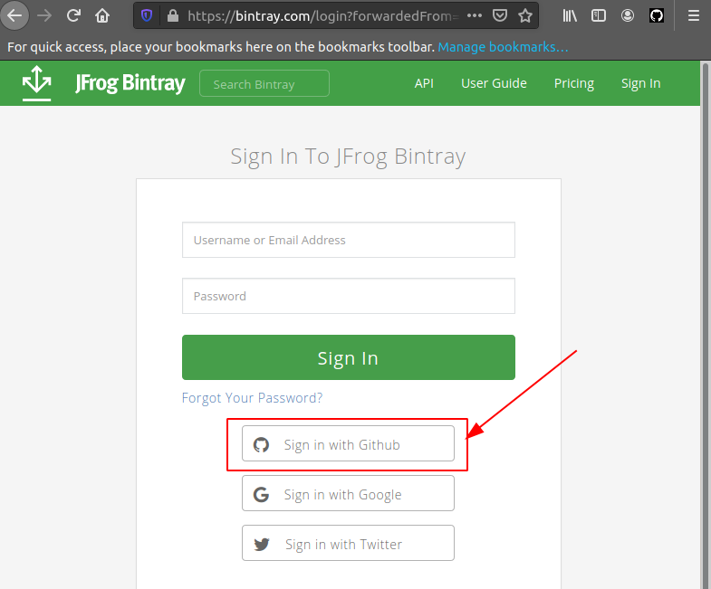
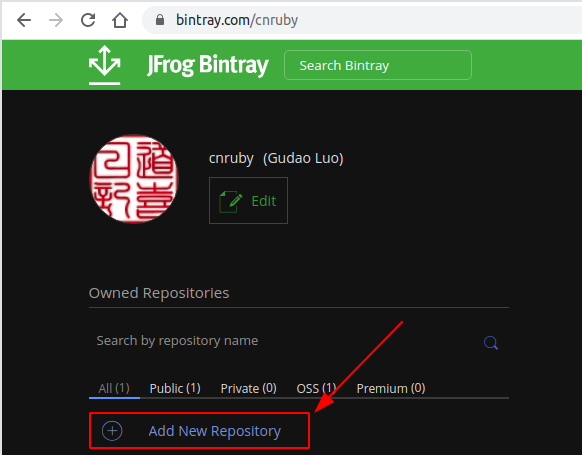
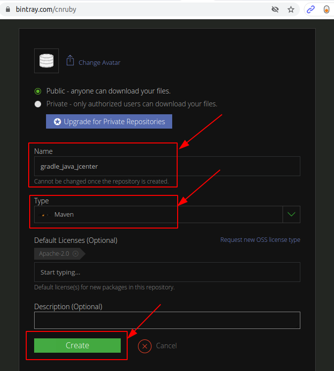
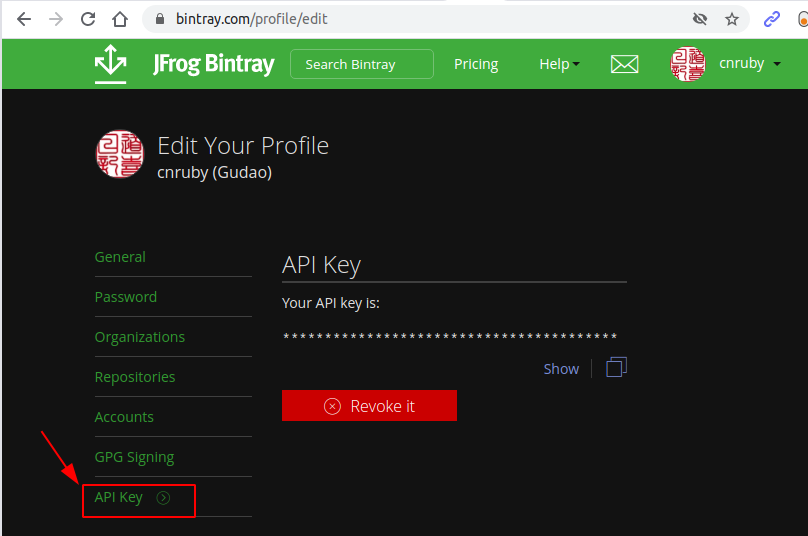
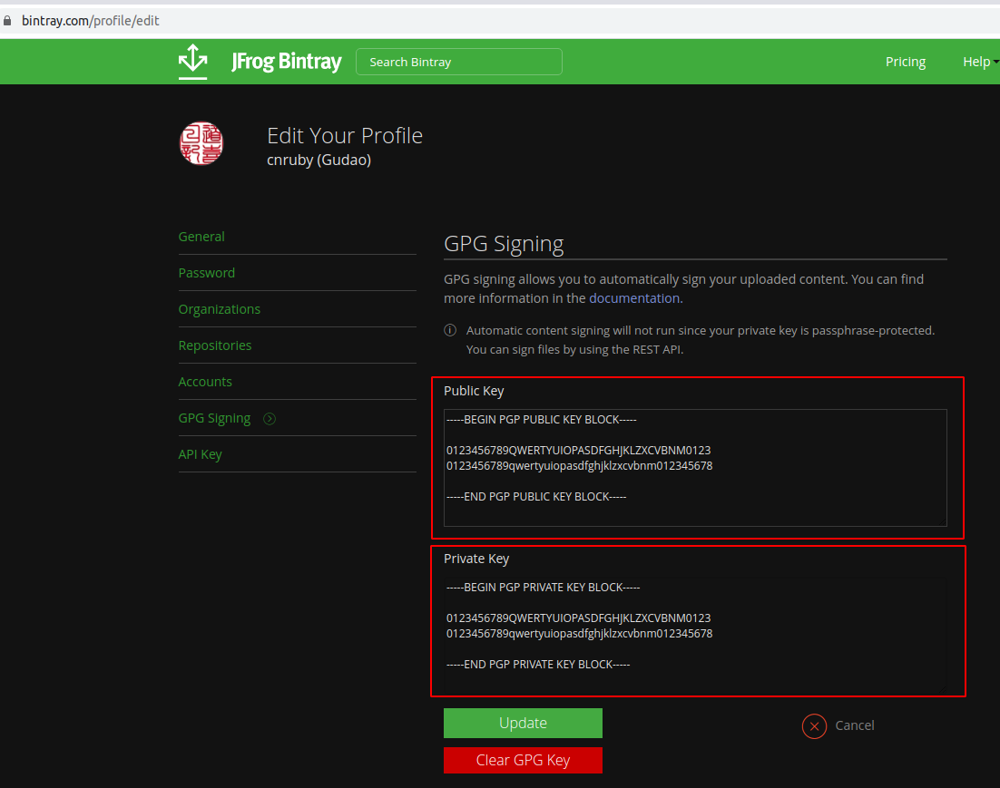
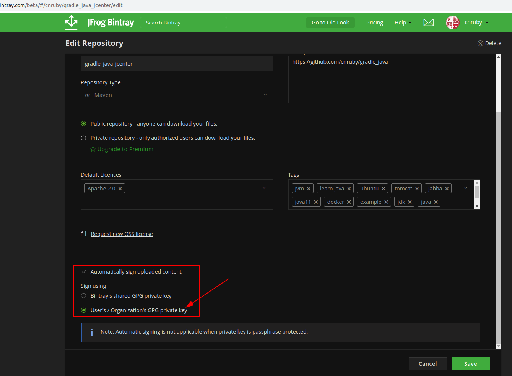

<a href = "https://openjdk.java.net/">

</a>

[](https://ubuntu.com/)
[](https://github.com/shyiko/jabba)
[](https://www.azul.com/downloads/zulu-community/?package=jdk)
[](https://bintray.com/login)

---

basic_004
<h1>Hello jcenter!</h1>


- [Keywords](#keywords)
- [Step 1: Use GitHub as jcenter Account](#step-1-use-github-as-jcenter-account)
- [Step 2: Create a jcenter's Repository for Your own Packages](#step-2-create-a-jcenters-repository-for-your-own-packages)
- [Step 3 Get jcenter's API Key](#step-3-get-jcenters-api-key)
- [Step 4 (Optional): Enable Auto Signing in Bintray](#step-4-optional-enable-auto-signing-in-bintray)
  - [Create gpg Public Key and Private Key](#create-gpg-public-key-and-private-key)
  - [Fill in both Public Key and Private Key in jcenter](#fill-in-both-public-key-and-private-key-in-jcenter)
  - [Enable auto signing](#enable-auto-signing)
- [Tip: How to verify a file using an asc signature file?](#tip-how-to-verify-a-file-using-an-asc-signature-file)
- [References](#references)

---

## Keywords
- jcenter package `central repository` Maven `JFrog Bintray`
- Ubuntu Java Gradle tutorial example


## Step 1: Use GitHub as jcenter Account
- jcenter's user name is the same as GitHub account name

```bash
google-chrome https://bintray.com/login?forwardedFrom=%2Fbintray%2Fjcenter
```




## Step 2: Create a jcenter's Repository for Your own Packages
- The jcenter's Repository name is A keyword for developer





## Step 3 Get jcenter's API Key
- The jcenter's API Key is A keyword for developer

```bash
# DO (Open Bintray's Edit Profile page and click at GPG Signing)
google-chrome https://bintray.com/profile/edit
    # >> Result 
```




## Step 4 (Optional): Enable Auto Signing in Bintray 


### Create gpg Public Key and Private Key

```bash
# DO (generate a key)
# !!! ENTER A gpg Passphrase
gpg --gen-key


# DO (see the created key's information)
gpg --list-keys
    # >> Result 
    # !!! PUBLIC_KEY_ID "0123456789QWERTYUIOPASDFGHJKLZXCVBNM0123"
    /home/gudao/.gnupg/pubring.kbx
    ------------------------------
    pub   rsa3072 2020-12-21 [SC] [expires: 2022-12-21]
        0123456789qwertyuiopasdfghjklzxcvbnm0123
    uid           [ultimate] Gudao Luo <gudao.luo@gmail.com>
    sub   rsa3072 2020-12-21 [E] [expires: 2022-12-21]


# DO (upload your public key to keyservers to make it useful)
# !!! REPLACE hier PUBLIC_KEY_ID "0123456789QWERTYUIOPASDFGHJKLZXCVBNM0123" with your public key
gpg --keyserver hkp://pool.sks-keyservers.net --send-keys 0123456789QWERTYUIOPASDFGHJKLZXCVBNM0123
    # >> Result 
    gpg: sending key 0123456789QWERTY to hkp://pool.sks-keyservers.net


# DO (export both public and private key as ASCII armor format)
gpg -a --export yourmail@email.com > public_key_sender_jcenter.asc
gpg -a --export-secret-key yourmail@email.com > private_key_sender_jcenter.asc
```

### Fill in both Public Key and Private Key in jcenter

```bash
# DO (COPY in both Public Key and Private Key using content in the files *.asc)
xclip -selection clipboard < public_key_sender_jcenter.asc 
xclip -selection clipboard < private_key_sender_jcenter.asc 
```

```bash
# DO (Open Bintray's Edit Profile page and click at GPG Signing)
google-chrome https://bintray.com/profile/edit
    # >> Result 
```



### Enable auto signing
- Sign in >> Click {a repository name} >> Actions >> Edit




## Tip: How to verify a file using an asc signature file?

```bash
# DO (Download the key file and jar file)
wget https://dl.bintray.com/cnruby/gradle_java_jcenter/de/iotoi/demo-jcenter/0.1.13/demo-jcenter-0.1.13.jar.asc

wget https://dl.bintray.com/cnruby/gradle_java_jcenter/de/iotoi/demo-jcenter/0.1.13/demo-jcenter-0.1.13.jar


# DO (Inspect the key file to confirm it has F5693BE15BD44FD2 as its keyid)
gpg --keyid-format long --list-options show-keyring demo-jcenter-0.1.13.jar.asc

    # >> Result
    gpg: WARNING: no command supplied.  Trying to guess what you mean ...
    gpg: assuming signed data in 'demo-jcenter-0.1.13.jar'
    gpg: Signature made Mo 21 Dez 2020 20:39:14 CET
    gpg:                using RSA key F5693BE15BD44FD2
    gpg: Good signature from "Gudao Luo <gudao.luo@gmail.com>" [ultimate]

# DO (If correct, then import the key)
gpg --import demo-jcenter-0.1.13.jar.asc

    # >> Result
    gpg: no valid OpenPGP data found.
    gpg: Total number processed: 0

# DO (Verify the jar)
gpg --verify demo-jcenter-0.1.13.jar.asc demo-jcenter-0.1.13.jar

    # >> Result
    gpg: Signature made Mo 21 Dez 2020 20:39:14 CET
    gpg:                using RSA key F5693BE15BD44FD2
    gpg: Good signature from "Gudao Luo <gudao.luo@gmail.com>" [ultimate]
```


## References
- https://bintray.com/bintray/jcenter
- https://inthecheesefactory.com/blog/how-to-upload-library-to-jcenter-maven-central-as-dependency/en
- https://dl.bintray.com/cnruby/gradle_java_jcenter/
- https://serverfault.com/questions/896228/how-to-verify-a-file-using-an-asc-signature-file