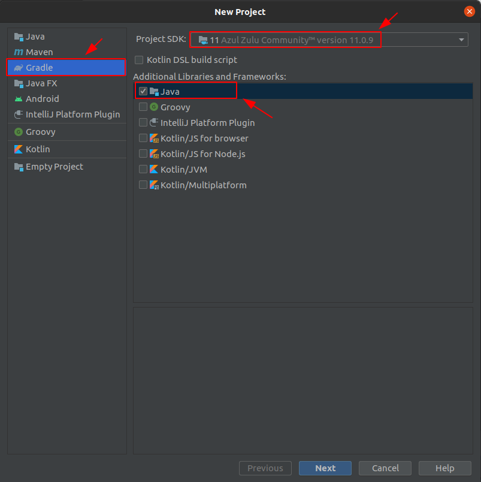
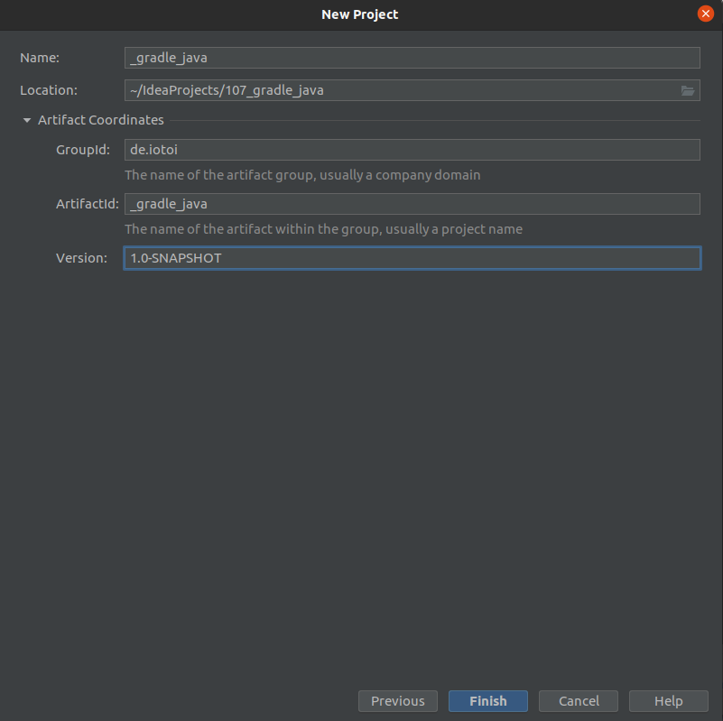
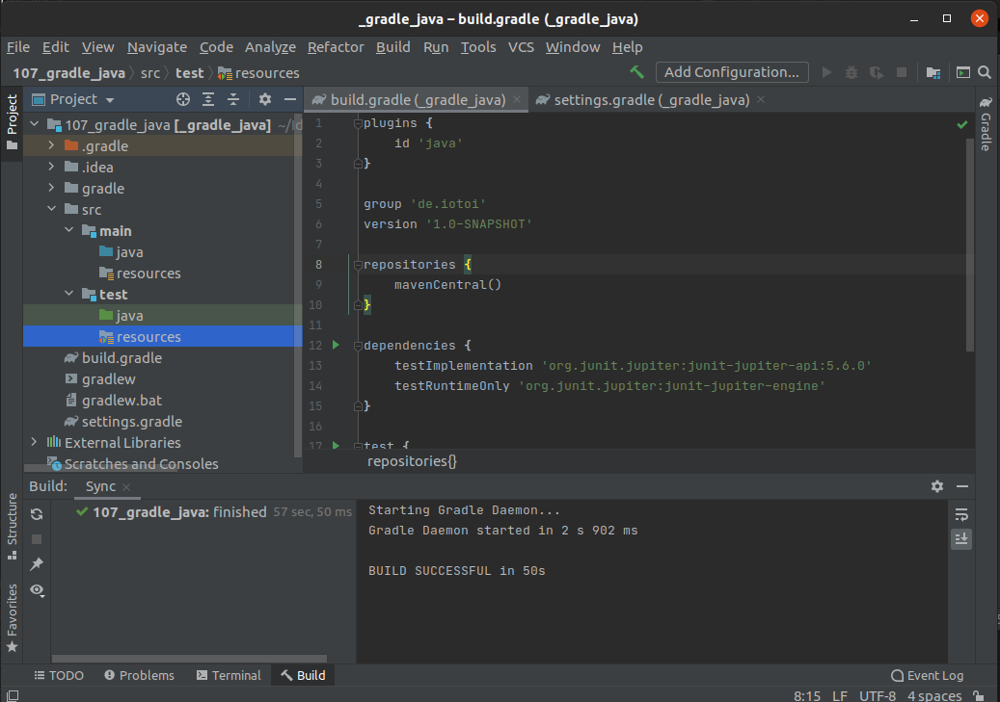

<a href = "https://openjdk.java.net/">

</a>

[](https://ubuntu.com/)
[](https://github.com/shyiko/jabba)
[](https://www.azul.com/downloads/zulu-community/?package=jdk)
[](https://www.jetbrains.com/de-de/idea/download/#section=linux)
[](https://app.circleci.com/pipelines/github/cnruby/gradle_java?branch=basic_011)

---

basic_001
# Hello IntelliJ IDEA!

## Download IntelliJ IDEA Community Version (Kostenlos, Open Source)
- https://www.jetbrains.com/de-de/idea/download/

## Create A Java Application




## References
- https://www.jetbrains.com/help/idea/getting-started-with-gradle.html
- https://www.jetbrains.com/help/idea/gradle.html
- https://tomgregory.com/5-tips-for-using-gradle-with-intellij-idea-2019/

## Download This compelete Project

```bash
# Download
git clone -b basic_000 https://github.com/cnruby/gradle_java.git 001_gradle_java
```
