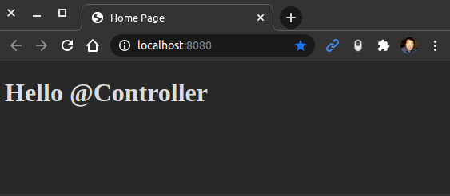

<a href = "https://openjdk.java.net/">

</a>

[](https://ubuntu.com/)
[](https://github.com/shyiko/jabba)
[](https://gradle.org/)
[](https://www.azul.com/downloads/zulu-community/?package=jdk)
[](https://www.jetbrains.com/de-de/idea/download/#section=linux)
[](https://www.docker.com/)
[](https://app.circleci.com/pipelines/github/cnruby/gradle_java?branch=basic_204)


---

Lesson 206: Hello @Controller!
<h1>Lesson 206: Hello @Controller!</h1>

- How to Understand the Annotation `@Controller`
- How to Understand the Web Page Template `Thymeleaf`


---


<h1>Table of Contents</h1>

- [Keywords](#keywords)
- [Prerequisites](#prerequisites)
- [Create A New Java Web App](#create-a-new-java-web-app)
  - [DO (create a new project)](#do-create-a-new-project)
  - [DO (edit the spring property file)](#do-edit-the-spring-property-file)
  - [DO (edit the gradle build file)](#do-edit-the-gradle-build-file)
  - [DO (check the project)](#do-check-the-project)
- [Develop the Project](#develop-the-project)
  - [DO (create and edit the web page file)](#do-create-and-edit-the-web-page-file)
  - [DO (create and edit a new spring controller file)](#do-create-and-edit-a-new-spring-controller-file)
  - [DO (check the project)](#do-check-the-project-1)
- [Start the Project](#start-the-project)
  - [DO (open a new terminal to start HotCode)](#do-open-a-new-terminal-to-start-hotcode)
  - [DO (open a new terminal to run the web application)](#do-open-a-new-terminal-to-run-the-web-application)
  - [DO (open a new terminal to access the web application)](#do-open-a-new-terminal-to-access-the-web-application)
- [References](#references)
- [References for tools](#references-for-tools)


## Keywords
- Annotation `@Controller` Java Web Application Thymeleaf Template Web Page
- `Java JDK` `IntelliJ CE` CircleCI CI
- tutorial example Ubuntu Gradle jabba JDK Java JVM
- `Spring Boot` `web app` web app `@Service`


## Prerequisites
- [install JDK on Ubuntu 20.04](https://github.com/cnruby/gradle_java/blob/basic_101/README.md)
- [install Gradle on Ubuntu 20.04](https://github.com/cnruby/gradle_java/blob/basic_102/README.md)
- [IntelliJ IDEA Community](https://www.jetbrains.com/de-de/idea/download/#section=linux)
- [install Docker on Ubuntu](https://docs.docker.com/engine/install/ubuntu/) OR [Using Docker](https://github.com/cnruby/gradle_java/tree/basic_002)
- [CircleCI Account](https://circleci.com/vcs-authorize/)


## Create A New Java Web App

### DO (create a new project)
```bash
EXISTING_APP_ID=205 && NEW_APP_ID=206 \
&& git clone -b basic_${EXISTING_APP_ID} https://github.com/cnruby/gradle_java.git ${NEW_APP_ID}_gradle_java \
&& cd ${NEW_APP_ID}_gradle_java
```

### DO (edit the spring property file)
```bash
nano ./src/main/resources/application.properties
```
```bash
# FILE (application.properties)
...
web.app.name=Hello @Controller
...
```

### DO (edit the gradle build file)
```bash
nano ./build.gradle
```
```bash
# FILE (build.gradle)
...
dependencies {
    implementation 'org.springframework.boot:spring-boot-starter-thymeleaf'
...
```

### DO (check the project)
```bash
./gradlew -q check
```
```bash
    # >> Result: nothing
```


## Develop the Project

### DO (create and edit the web page file)
```bash
mkdir ./src/main/resources/templates
```
```bash
touch ./src/main/resources/templates/home.html
```
```bash
nano ./src/main/resources/templates/home.html
```
```html
<!-- FILE (home.html) -->
<!DOCTYPE html>
<html lang="en" xmlns:th="http://www.w3.org/1999/xhtml">
    <head>
        <meta charset="UTF-8">
        <title>Home Page</title>
    </head>
    <body>
        <h1><span th:text="${webAppName}">...</span></h1>
    </body>
</html>
```

### DO (create and edit a new spring controller file)
```bash
touch ./src/main/java/de/iotoi/HelloHtmlController.java
```
```bash
nano ./src/main/java/de/iotoi/HelloHtmlController.java
```
```java
// FILE (HelloHtmlController.java)
package de.iotoi;

import org.springframework.beans.factory.annotation.Value;
import org.springframework.stereotype.Controller;
import org.springframework.ui.Model;
import org.springframework.web.bind.annotation.GetMapping;

@Controller
public class HelloHtmlController {
  @Value("${web.app.name}")
  String webAppName;

  @GetMapping("/")
  public String homePage(Model model) {
    model.addAttribute("webAppName", webAppName);
    // !!! (go to home.html)
    return "home";
  }
}
```

### DO (check the project)
```bash
./gradlew -q check
```
```bash
    # >> Result: nothing
```


## Start the Project

### DO (open a new terminal to start HotCode)
```bash
./gradlew -q bootJar --continuous
```

### DO (open a new terminal to run the web application)
```bash
./gradlew -q bootRun
```
```bash
    # >> Result
    Hello @Controller from init()!
    Hello @Controller from init()!!
    <==========---> 80% EXECUTING [49s]
    > :bootRun
```

### DO (open a new terminal to access the web application)
```bash
curl --no-progress-meter http://localhost:8080/
```
```bash
    # >>> Result
    <!DOCTYPE html>
    <html lang="en">
    <head>
        <meta charset="UTF-8">
        <title>Home Page</title>
    </head>
    <body>
        <h1><span>Hello @Controller</span></h1>
    </body>
```

```bash
google-chrome http://localhost:8080/
```
```bash
    # >>> Result
```



## References
- https://stackoverflow.com/questions/54937518/visual-studio-code-spring-boot-reload-static-content/55370810
- https://mkyong.com/spring-boot/intellij-idea-spring-boot-template-reload-is-not-working/
- https://gist.github.com/IMRFeng/eed589de6a6362ef23bc189fb135fdea
- https://www.vojtechruzicka.com/spring-boot-devtools/
- https://stackoverflow.com/questions/33349456/how-to-make-auto-reload-with-spring-boot-on-idea-intellij
- https://stackoverflow.com/questions/54556072/hot-to-hotswap-code-in-intellij-in-a-spring-boot-project
- https://www.nexsoftsys.com/articles/hot-swapping-in-spring-boot-applications.html
- https://stackoverflow.com/questions/57408522/spring-boot-maven-not-printing-logs-on-console


## References for tools
- [Add a copy to clipboard button in a GitHub](https://github.com/zenorocha/codecopy#install)