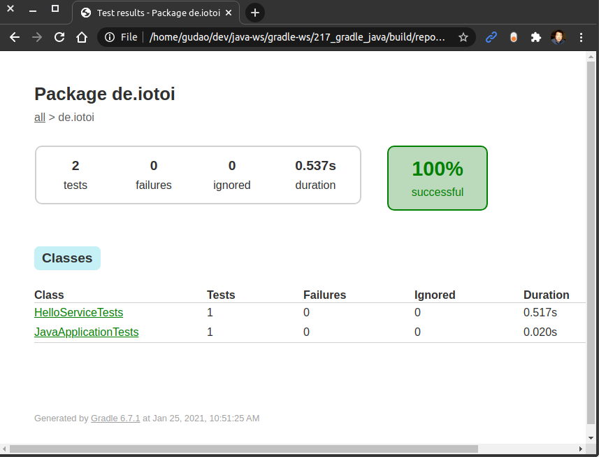

<a href = "https://openjdk.java.net/">

</a>

[](https://ubuntu.com/)
[](https://github.com/shyiko/jabba)
[](https://gradle.org/)
[](https://www.azul.com/downloads/zulu-community/?package=jdk)
[](https://www.jetbrains.com/de-de/idea/download/#section=linux)
[](https://www.docker.com/)
[](https://app.circleci.com/pipelines/github/cnruby/gradle_java?branch=basic_217)


---

Lesson 217: Hello JUnit 5!
<h1>Lesson 217: Hello JUnit 5!</h1>

- How to Understand the unit testing framework `JUnit` `JUnit 5`
- JUnit is particularly suitable for automated unit tests of individual units (classes or methods)
- Every test method must be annotated by the @Test annotation
- Every test method has only two results: Either the test succeeds (then it is "green"(OK)) or it fails (then it is "red"(ERROR)).
- JUnit is linked as a JAR at compile-time


---


<h1>Table of Contents</h1>

- [Keywords](#keywords)
- [Prerequisites](#prerequisites)
- [Create A New Java Web App](#create-a-new-java-web-app)
  - [DO (create a new project)](#do-create-a-new-project)
  - [DO (edit the spring property file)](#do-edit-the-spring-property-file)
  - [DO (check the project)](#do-check-the-project)
- [Develop the Project for JUnit 5](#develop-the-project-for-junit-5)
  - [DO (create and edit the spring test file)](#do-create-and-edit-the-spring-test-file)
- [Test The Web Application on the Project](#test-the-web-application-on-the-project)
  - [DO (run the spring test command)](#do-run-the-spring-test-command)
  - [DO (view the spring test result)](#do-view-the-spring-test-result)
- [References](#references)
- [References for tools](#references-for-tools)


## Keywords
- JUnit `Spring Boot` Annotation `@Test` Testing Test
- `Java JDK` `IntelliJ CE` CircleCI CI
- tutorial example Ubuntu Gradle jabba JDK Java JVM
- `Spring Boot` `web app` web app Annotation `@Service`


## Prerequisites
- [install JDK on Ubuntu 20.04](https://github.com/cnruby/gradle_java/blob/basic_101/README.md)
- [install Gradle on Ubuntu 20.04](https://github.com/cnruby/gradle_java/blob/basic_102/README.md)
- [IntelliJ IDEA Community](https://www.jetbrains.com/de-de/idea/download/#section=linux)
- [install Docker on Ubuntu](https://docs.docker.com/engine/install/ubuntu/) OR [Using Docker](https://github.com/cnruby/gradle_java/tree/basic_002)
- [CircleCI Account](https://circleci.com/vcs-authorize/)


## Create A New Java Web App

### DO (create a new project)
```bash
EXISTING_APP_ID=205 && NEW_APP_ID=217 \
&& git clone -b basic_${EXISTING_APP_ID} https://github.com/cnruby/gradle_java.git ${NEW_APP_ID}_gradle_java \
&& cd ${NEW_APP_ID}_gradle_java
```

### DO (edit the spring property file)
```bash
nano ./src/main/resources/application.properties
```
```bash
# FILE (application.properties)
...
web.app.name=Hello JUnit 5
logging.level.root=WARN
```

### DO (check the project)
```bash
./gradlew -q check
```
```bash
    # >> Result: nothing
```


## Develop the Project for JUnit 5

### DO (create and edit the spring test file)
```bash
touch ./src/test/java/de/iotoi/HelloServiceTests.java
```
```bash
nano ./src/test/java/de/iotoi/HelloServiceTests.java
```
```bash
# FILE (HelloServiceTests.java)
package de.iotoi;

import org.junit.jupiter.api.*;
import org.springframework.beans.factory.annotation.*;
import org.springframework.boot.test.context.SpringBootTest;
import static org.junit.jupiter.api.Assertions.assertEquals;

@SpringBootTest
public class HelloServiceTests {
	@Autowired
	HelloService helloService;

	@Value("${web.app.name}")
	String webAppName;

	@DisplayName("Test Spring @Autowired Integration")
	@Test
	public void testAnnotationGetHello() {
		assertEquals(webAppName, "Hello JUnit 5");
		assertEquals(webAppName + "!!\n", helloService.getHello());
	}
}
```


## Test The Web Application on the Project

### DO (run the spring test command)
```bash
./gradlew -q test
```
```bash
    # >> Result: nothing
```

### DO (view the spring test result)
```bash
google-chrome ./build/reports/tests/test/index.html
```
```bash
    # >> Result
```



## References
- https://junit.org/junit5/docs/current/user-guide/
- https://www.baeldung.com/junit-5
- https://www.innoq.com/de/articles/2019/12/junit5-spring-boot-tests/
- https://developer.okta.com/blog/2019/03/28/test-java-spring-boot-junit5
- https://medium.com/@thankgodukachukwu/unit-and-integrated-testing-spring-boot-and-junit-5-99b9745b782a
- https://mkyong.com/spring-boot/spring-boot-junit-5-mockito/
- https://www.trion.de/news/2020/05/26/testcontainers-junit5.html
- https://en.wikipedia.org/wiki/JUnit
- https://de.wikipedia.org/wiki/JUnit


## References for tools
- [Add a copy to clipboard button in a GitHub](https://github.com/zenorocha/codecopy#install)
