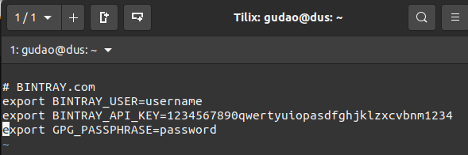

<a href = "https://openjdk.java.net/">

</a>


[](https://ubuntu.com/)
[](https://github.com/shyiko/jabba)
[](https://www.azul.com/downloads/zulu-community/?package=jdk)
[](https://gradle.org/)
[](https://github.com/cnruby/gradle_java/actions?query=workflow%3ACI--basic_116)
[](https://github.com/cnruby/gradle_java/actions?query=workflow%3ARelease--basic_116)
[](https://app.circleci.com/pipelines/github/cnruby/gradle_java?branch=basic_116)


---


basic_116 Hello Gradle Properties!
<h1>Lesson 116: Hello Gradle Properties!</h1>

- How to Use Gradle Properties in the build file


---


- [Keywords](#keywords)
- [Prerequisites](#prerequisites)
- [Method 1: From command line](#method-1-from-command-line)
  - [add a gradle task `propertiesCommand`](#add-a-gradle-task-propertiescommand)
  - [Use the properties from command line](#use-the-properties-from-command-line)
- [Method 2: From terminal's current shell](#method-2-from-terminals-current-shell)
  - [check the system variables](#check-the-system-variables)
  - [add properties to current shell](#add-properties-to-current-shell)
  - [add a gradle task `propertiesSystem`](#add-a-gradle-task-propertiessystem)
  - [Use the properties from terminal's current shell](#use-the-properties-from-terminals-current-shell)
- [Method 3: From System File](#method-3-from-system-file)
  - [check the system variables](#check-the-system-variables-1)
  - [add properties to system file `~/.bashrc`](#add-properties-to-system-file-bashrc)
  - [Use the properties from system file](#use-the-properties-from-system-file)
- [Method 4: From default Gradle Properties File](#method-4-from-default-gradle-properties-file)
  - [add properties to gradle properties file `gradle.properties`](#add-properties-to-gradle-properties-file-gradleproperties)
  - [add a gradle task `propertiesGradle`](#add-a-gradle-task-propertiesgradle)
  - [Use the properties from default gradle properties file](#use-the-properties-from-default-gradle-properties-file)
- [Method 5: From Groovy File](#method-5-from-groovy-file)
  - [add properties to groovy file `jcenter.properties`](#add-properties-to-groovy-file-jcenterproperties)
  - [add a gradle task `propertiesGroovy`](#add-a-gradle-task-propertiesgroovy)
  - [Use the properties from groovy file](#use-the-properties-from-groovy-file)
- [About the properties for `./build.gradle`](#about-the-properties-for-buildgradle)
  - [Use the command line properties for `./build.gradle`](#use-the-command-line-properties-for-buildgradle)
  - [Use the system properties for `./build.gradle`](#use-the-system-properties-for-buildgradle)
  - [Use the gradle properties for `./build.gradle`](#use-the-gradle-properties-for-buildgradle)
  - [Use the groovy properties for `./build.gradle`](#use-the-groovy-properties-for-buildgradle)
- [Tip: Use Gradle Tasks](#tip-use-gradle-tasks)


---

## Keywords
- `gradle properties` Gradle gradlew `gradle projects` groovy `system variable` `build file`
- Ubuntu Java tutorial example terminal shell


## Prerequisites
- [install JDK on Ubuntu 20.04](https://github.com/cnruby/gradle_java/blob/basic_101/README.md)
- [install Gradle on Ubuntu 20.04](https://github.com/cnruby/gradle_java/blob/basic_102/README.md)


## Method 1: From command line
- If develop a project, then change real username and password value etc. for the follow commands

### add a gradle task `propertiesCommand`

```bash
# DO (edit the file "./build.gradle")
nano ./build.gradle
    # FILE (./build.gradle)
    ...
    task propertiesCommand {
        group = 'de.iotoi'
        description = 'Get Properties from command line'

        doLast {
            def cmdBintrayUser = project.findProperty("BINTRAY_USER")
            def cmdBintrayApiKey = project.findProperty('BINTRAY_API_KEY')
            def cmdGpgPassphrase = project.findProperty('GPG_PASSPHRASE')

            println "cmdBintrayUser = " + cmdBintrayUser
            println "cmdBintrayApiKey = " + cmdBintrayApiKey
            println "cmdGpgPassphrase = " + cmdGpgPassphrase
        }
    }
```

### Use the properties from command line

```bash
# DO (run all checks)
./gradlew -q check
    # >> Result: nothing

# DO (get properties from command line)
./gradlew -q propertiesCommand -PBINTRAY_USER=username_cmd -PBINTRAY_API_KEY=1234567890qwertyuiopasdfghjklzxcvbnm1234 -PGPG_PASSPHRASE=password_cmd
    # >> Result:
    cmdBintrayUser = username_cmd
    cmdBintrayApiKey = 1234567890qwertyuiopasdfghjklzxcvbnm1234
    cmdGpgPassphrase = password_cmd
```


## Method 2: From terminal's current shell

### check the system variables
```bash
# DO (query the system variables)
echo $BINTRAY_USER $BINTRAY_API_KEY $GPG_PASSPHRASE
    # >> Result: nothing
```

### add properties to current shell
```bash
# DO (add properties to current shell)
export BINTRAY_USER=username_shell
export BINTRAY_API_KEY=1234567890qwertyuiopasdfghjklzxcvbnm1234
export GPG_PASSPHRASE=password_shell
```

### add a gradle task `propertiesSystem`
```bash
# DO (edit the file "./build.gradle")
nano ./build.gradle

    # FILE (./build.gradle)
    ...
    task propertiesSystem {
        group = 'de.iotoi'
        description = 'Get Properties from system file'

        doLast {
            def sysBintrayUser = System.getenv("BINTRAY_USER")
            def sysBintrayApiKey = System.getenv('BINTRAY_API_KEY')
            def sysGpgPassphrase = System.getenv('GPG_PASSPHRASE')

            println "sysBintrayUser = " + sysBintrayUser
            println "sysBintrayApiKey = " + sysBintrayApiKey
            println "sysGpgPassphrase = " + sysGpgPassphrase
        }
    }
```

### Use the properties from terminal's current shell

```bash
# DO (run all checks)
./gradlew -q check
    # >> Result: nothing

# DO (query the system variables)
echo $BINTRAY_USER $BINTRAY_API_KEY $GPG_PASSPHRASE
    # >> Result:
    username_shell 1234567890qwertyuiopasdfghjklzxcvbnm1234 password_shell

# DO (get properties from current shell)
./gradlew -q propertiesSystem
    # >> Result:
    sysBintrayUser = username_shell
    sysBintrayApiKey = 1234567890qwertyuiopasdfghjklzxcvbnm1234
    sysGpgPassphrase = password_shell
```


## Method 3: From System File

### check the system variables

```bash
# DO (close the current shell)
# DO (open a new shell)
# DO (run the task "propertiesSystem")
./gradlew -q propertiesSystem
    # >> Result:
    sysBintrayUser = null
    sysBintrayApiKey = null
    sysGpgPassphrase = null
```

### add properties to system file `~/.bashrc`
```bash
# DO (add system variables to file "~/.bashrc")
echo "" >> ~/.bashrc
echo "# BINTRAY.com" >> ~/.bashrc
echo "export BINTRAY_USER=username" >> ~/.bashrc
echo "export BINTRAY_API_KEY=1234567890qwertyuiopasdfghjklzxcvbnm1234" >> ~/.bashrc
echo "export GPG_PASSPHRASE=password" >> ~/.bashrc
cat ~/.bashrc
    # >> Result
```



### Use the properties from system file
```bash
# DO (enable the system variables)
. ~/.bashrc

# DO (run all checks)
./gradlew -q check
    # >> Result: nothing

# DO (get properties from system file)
./gradlew -q propertiesSystem
    # >> Result:
    sysBintrayUser = username
    sysBintrayApiKey = 1234567890qwertyuiopasdfghjklzxcvbnm1234
    sysGpgPassphrase = password
```


## Method 4: From default Gradle Properties File
- !!! WARNING: The `password` and `API Key` etc SHOULD NOT BE SAVED IN the file `gradle.properties`,
- The gradle properties file must be saved in the file `gradle.properties` and be in project's root folder. Otherwise use the method 4 or 6.

### add properties to gradle properties file `gradle.properties`
```bash
# DO (create a gradle properties file)
touch ./gradle.properties

# DO (edit a gradle properties file)
nano ./gradle.properties

    # FILE (./gradle.properties)
    version="0.116.1"
```

### add a gradle task `propertiesGradle`
```bash
# DO (edit the file "./build.gradle")
nano ./build.gradle
    # FILE (./build.gradle)
    ...
    task propertiesGradle {
        group = 'de.iotoi'
        description = 'Get Properties from gradle properties file'

        doLast {
            def projectVersion = project.findProperty("version")

            println "projectVersion = " + projectVersion
        }
    }
```

### Use the properties from default gradle properties file
```bash
# DO (run all checks)
./gradlew -q check
    # >> Result: nothing

# DO (get properties from gradle properties file)
./gradlew propertiesGradle
    # >> Result
    > Task :propertiesGradle
    projectVersion = "0.116.1"

    BUILD SUCCESSFUL in 1s
    1 actionable task: 1 executed
```


## Method 5: From Groovy File
- !!! WARNING: The file with `password` etc SHOULD NOT BE SAVED UNDER THIS PROJECT
- The groovy file name can be any ONE and saved in any FOLDER

### add properties to groovy file `jcenter.properties`
```bash
# DO (create a groovy file)
touch ../jcenter.properties
# DO (edit a groovy file)
nano ../jcenter.properties

    # FILE (./jcenter.properties)
    ext {
        bintrayUser = "username_groovy"
        bintrayApiKey = "1234567890qwertyuiopasdfghjklzxcvbnm1234"
        gpgPassphrase = "password_groovy"
    }
```

### add a gradle task `propertiesGroovy`
```bash
# DO (edit the file "./build.gradle")
nano ./build.gradle
    # FILE (./build.gradle)
    ...
    task propertiesGroovy {
        group = 'de.iotoi'
        description = 'Get Properties from groovy file'

        doLast {
            apply from: System.getenv("HOME") + "/jcenter.properties"

            def groovyBintrayUser = project.findProperty("bintrayUser")
            def groovyBintrayApiKey = project.findProperty("bintrayApiKey")
            def groovyGpgPassphrase = project.findProperty("gpgPassphrase")
            
            println "groovyBintrayUser = " + groovyBintrayUser
            println "groovyBintrayApiKey = " + groovyBintrayApiKey
            println "groovyGpgPassphrase = " + groovyGpgPassphrase
        }
    }
```

### Use the properties from groovy file
```bash
# DO (run all checks)
./gradlew -q check
    # >> Result: nothing

# DO (get properties from groovy file)
./gradlew -q propertiesGroovy
    # >> Result
    groovyBintrayUser = username_groovy
    groovyBintrayApiKey = 1234567890qwertyuiopasdfghjklzxcvbnm1234
    groovyGpgPassphrase = password_groovy
```


## About the properties for `./build.gradle`
- The above tasks are ONLY used to how to use the properties
- The follow codes are used for develop the code.

### Use the command line properties for `./build.gradle`

```bash
# DO (edit the file "./build.gradle")
nano ./build.gradle

    # FILE (./build.gradle)
    ...
    bintrayUser = project.findProperty("BINTRAY_USER")
    bintrayApiKey = project.findProperty("BINTRAY_API_KEY")
    gpgPassphrase = project.findProperty("GPG_PASSPHRASE")
    repositories {
        jcenter()
    }
    ...
```

### Use the system properties for `./build.gradle`
```bash
# DO (edit the file "./build.gradle")
nano ./build.gradle

    # FILE (./build.gradle)
    ...
    bintrayUser = System.getenv("BINTRAY_USER")
    bintrayApiKey = System.getenv('BINTRAY_API_KEY')
    gpgPassphrase = System.getenv('GPG_PASSPHRASE')
    repositories {
        jcenter()
    }
    ...
```

### Use the gradle properties for `./build.gradle`
- !!! WARNING: The `password` and `API Key` etc SHOULD NOT be saved in the file `gradle.properties`

```bash
# DO (edit the file "./build.gradle")
nano ./build.gradle

    # FILE (./build.gradle)    
    ...
    group = "your_group"
    version = project.property("version")
    ...
```

### Use the groovy properties for `./build.gradle`
- !!! WARNING: The any groovy properties file like `jcenter.properties` with `password` etc. SHOULD NOT BE IN THIS PROJECT

```bash
# DO (edit the file "./build.gradle")
nano ./build.gradle

    # FILE (./build.gradle)
    ...
    apply from: System.getenv("HOME") + "/jcenter.properties"

    bintrayUser = project.findProperty("bintrayUser")
    bintrayApiKey = project.findProperty("bintrayApiKey")
    gpgPassphrase = project.findProperty("gpgPassphrase")
    repositories {
        jcenter()
    }
    ...
```

## Tip: Use Gradle Tasks

```bash
./gradlew tasks

    # >> Result
    ...
    De.iotoi tasks
    --------------
    propertiesCommand - Get Properties from command line
    propertiesGradle - Get Properties from default gradle properties file
    propertiesGroovy - Get Properties from groovy file
    propertiesSystem - Get Properties from system file
    ...
```
