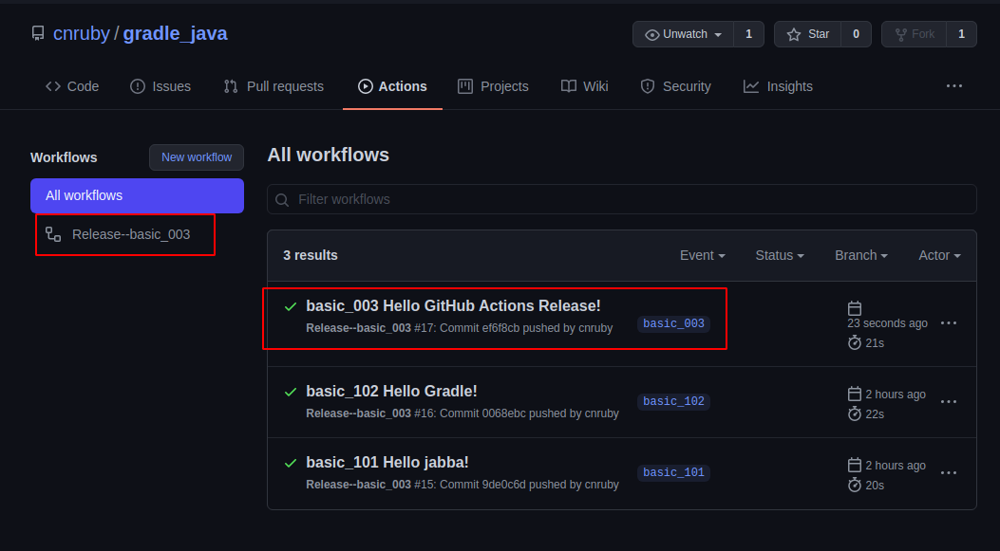
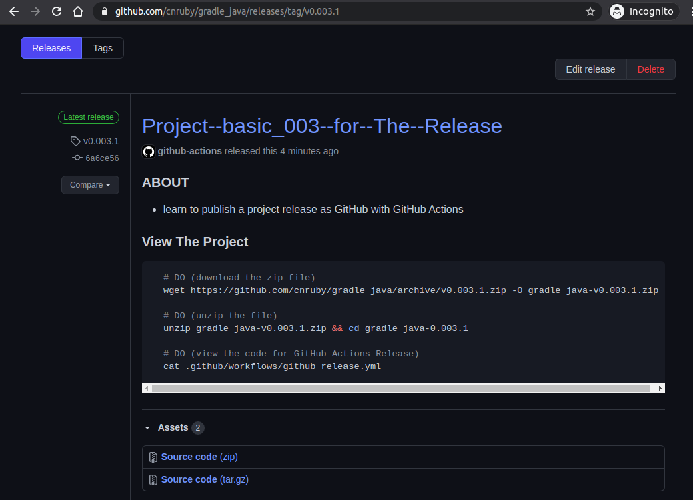
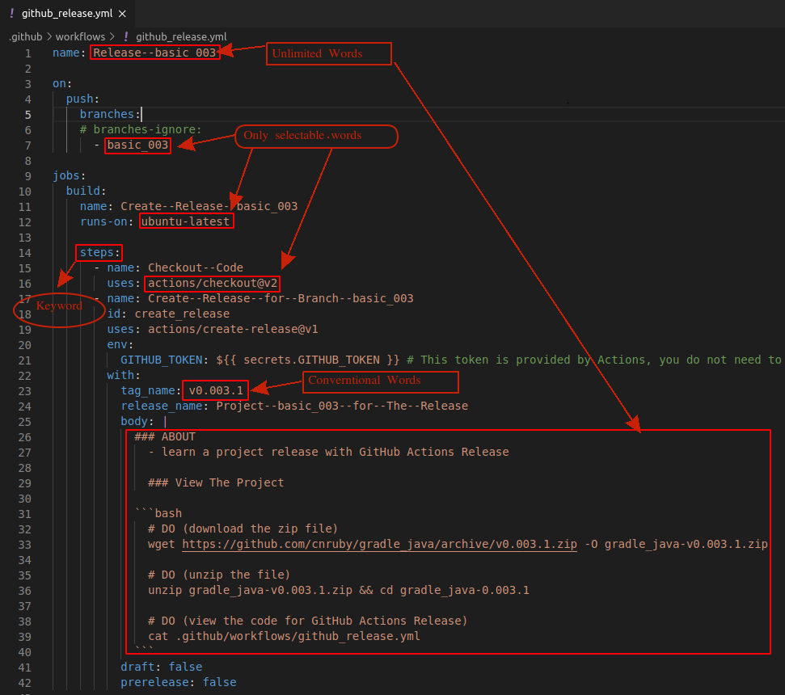

<a href = "https://openjdk.java.net/">

</a>

[](https://ubuntu.com/)
[](https://github.com/shyiko/jabba)
[](https://www.azul.com/downloads/zulu-community/?package=jdk)
[](https://www.jetbrains.com/de-de/idea/download/#section=linux)
[](https://app.circleci.com/pipelines/github/cnruby/gradle_java?branch=basic_000)
[](https://github.com/cnruby/gradle_java/releases/tag/v0.003.1)


---


basic_003
<h1>Hello GitHub Actions Release!</h1>


## Step1: Add a GitHub Action file `github_release.yml`

```bash
# DO (create a GitHub Action file)
mkdir -p .github/workflows
touch .github/workflows/github_release.yml

# DO (edit the GitHub Action file)
nano .github/workflows/github_release.yml

    # FILE (.github/workflows/github_release.yml)
    name: Release--basic_003

    on: 
        push:
            branches:
            # branches-ignore:
                - basic_003

    jobs:
    build:
        name: Create--Release--basic_003
        runs-on: ubuntu-latest

        steps:
        - name: Checkout--Code
            uses: actions/checkout@v2
        - name: Create--Release--for--Branch--"basic_003"
            id: create_release
            uses: actions/create-release@v1
            env:
            GITHUB_TOKEN: ${{ secrets.GITHUB_TOKEN }}
            with:
            tag_name: v0.003.1
            release_name: Project--"basic_003"--for--The--Release
            body: |
                ### ABOUT
                - learn a project release with GitHub Actions Release
                
                ### View The Project

                ```bash
                # DO (download the zip file)
                wget https://github.com/cnruby/gradle_java/archive/v0.003.1.zip -O gradle_java-0.003.1.zip

                # DO (unzip the file)
                unzip gradle_java-0.003.1.zip && cd gradle_java-0.003.1

                # DO (view the code for GitHub Actions Release)
                cat .github/workflows/github_release.yml
                ```
            draft: false
            prerelease: false
```


## Step 2: Push the GitHub Actions release file to GitHub

```bash
# DO (push the file ".github/workflows/github_release.yml" to GitHub.com)
git commit -m "basic_003 Hello GitHub Actions Release!"
git push
```


## Step 3: View The Actions and Release on GibHub.com

```bash
# DO (View The GitHub Actions)
google-chrome https://github.com/cnruby/gradle_java/actions
```



```bash
# DO (View The Release)
google-chrome https://github.com/cnruby/gradle_java/releases/tag/v0.003.1
```




## Working Processes

```bash
# FOR loop
    # DO (change any code )
    # DO (edit the file `github_release.yml`)    
    nano .github/workflows/github_release.yml
    # DO (Ctrl+O, ENTER, Ctrl+X)

        # OLD FILE (.github/workflows/github_release.yml)
        ...
        tag_name: v0.003.1
        ...

        # NEW FILE (.github/workflows/github_release.yml)
        ...
        tag_name: v0.003.2
        ...
# ENDFOR
```


## Tip 1: About the File `github_release.yml`




## Tip 2: Enable and Disable the GitHub Actions Release

```bash
# Enable the GitHub Actions Release
...
    on: 
        push:
            branches:
                - basic_003
...
```

```bash
# Disable the GitHub Actions Release
...
    on: 
        push:
            branches-ignore:
                - basic_003
...
```


## Download This complete Project

```bash
# DO (Download)
git clone -b basic_003 https://github.com/cnruby/gradle_java.git 003_gradle_java
```


## References
- https://github.com/actions/create-release
- https://www.toolsqa.com/git/github-releases/
- https://github.com/marketplace/actions/publish-release
- https://rogerdudler.github.io/git-guide/index.de.html
- https://rogerdudler.github.io/git-guide/index.html
- https://rogerdudler.github.io/git-guide/index.zh.html

