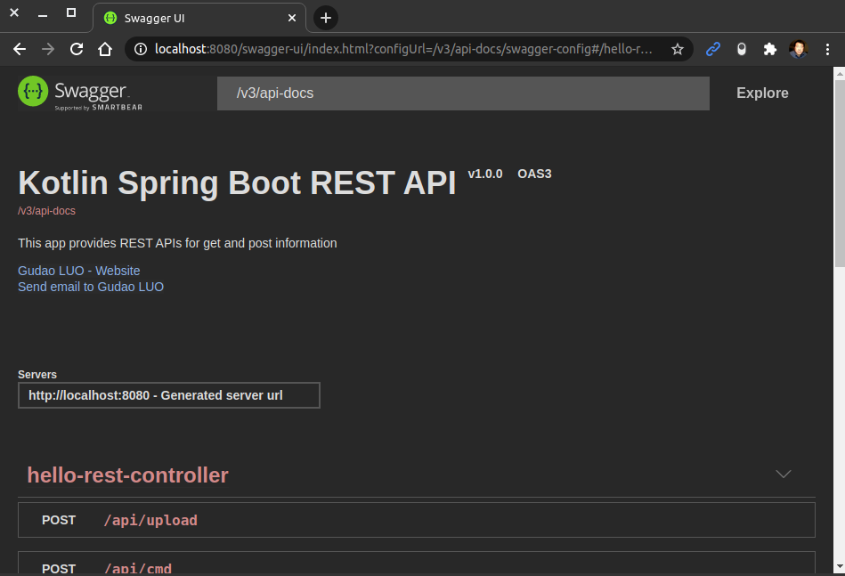
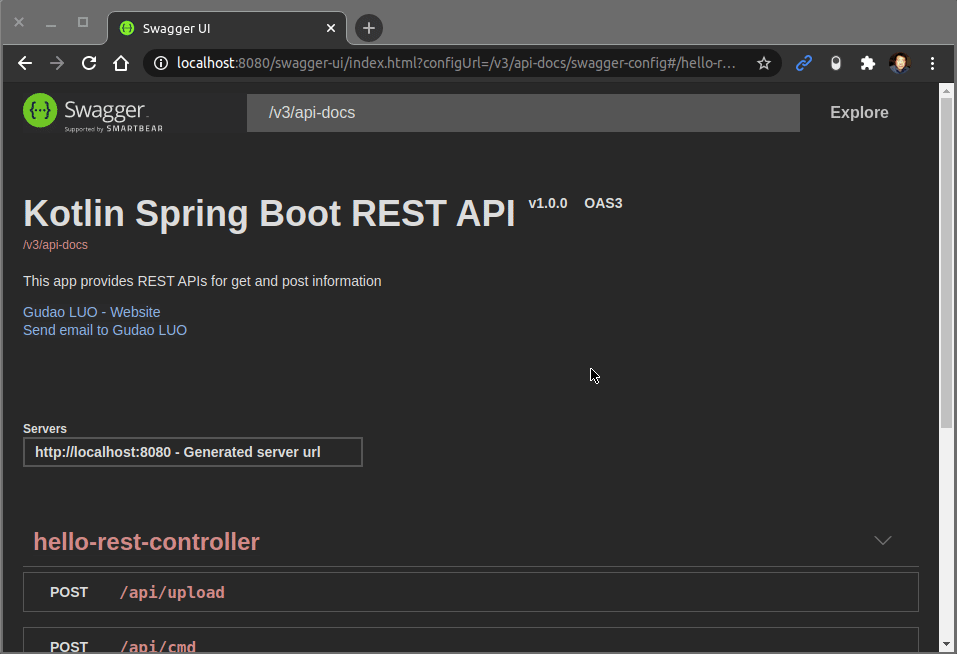
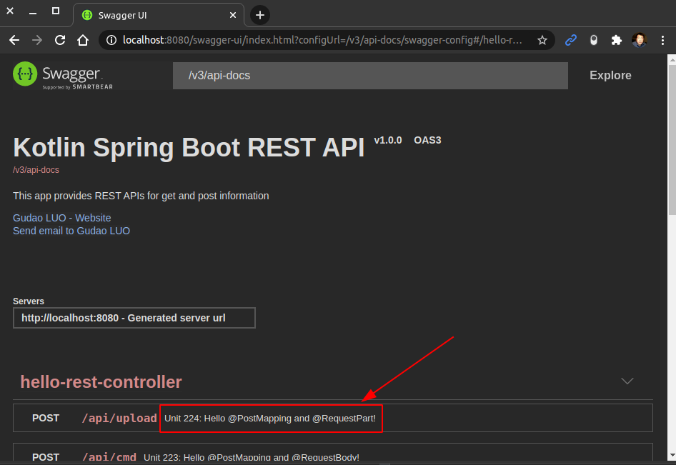
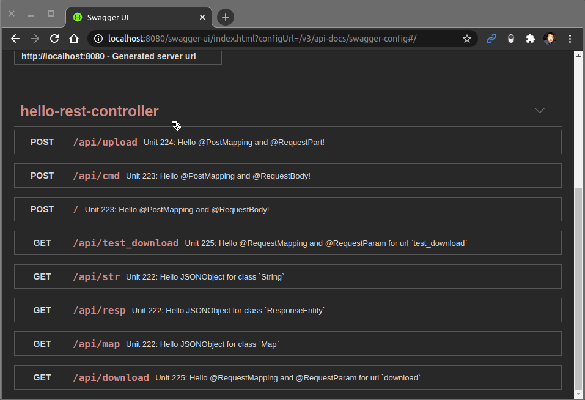
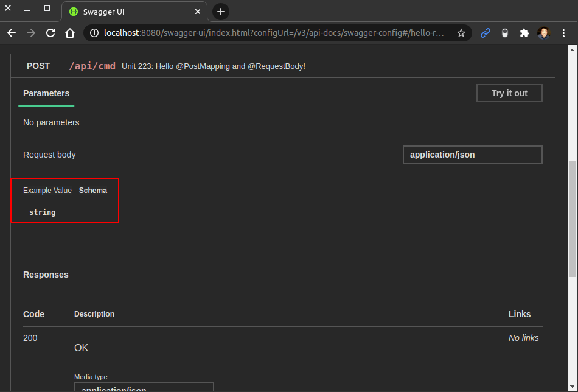
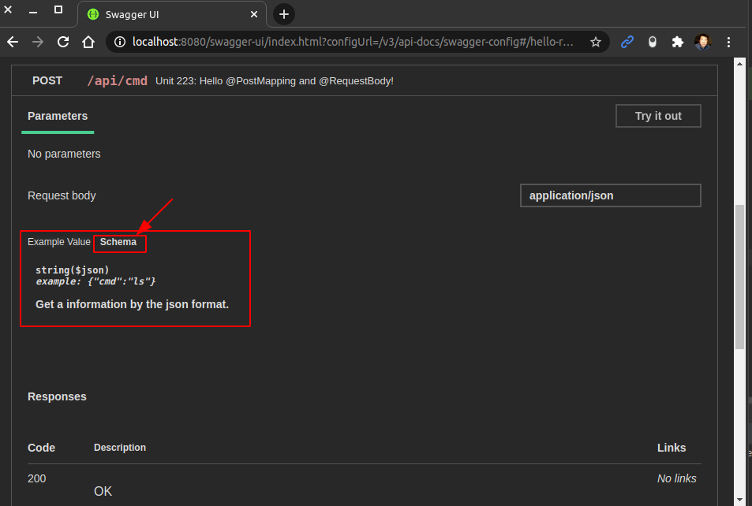
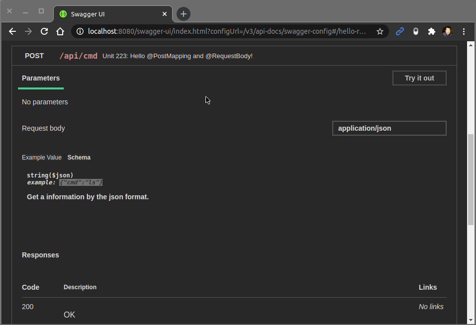

<a href = "https://openjdk.java.net/">

</a>

[](https://ubuntu.com/)
[](https://github.com/shyiko/jabba)
[](https://gradle.org/)
[](https://www.azul.com/downloads/zulu-community/?package=jdk)
[](https://www.jetbrains.com/de-de/idea/download/#section=linux)
[](https://www.docker.com/)
[](https://app.circleci.com/pipelines/github/cnruby/gradle_java?branch=basic_226)


---

Lesson 226: Hello OpenAPI!
<h1>Lesson 226: Hello OpenAPI!</h1>

- How to Understand the Java Document `OpenAPI`

---


<h1>Table of Contents</h1>

- [Keywords](#keywords)
- [Prerequisites](#prerequisites)
- [Create A New Java Web App](#create-a-new-java-web-app)
  - [DO (create a new project)](#do-create-a-new-project)


## Keywords
- OpenAPI Annotation `@Operation` `@Schema` Document API
- Annotation `@RequestMapping` `@RequestParam` `Spring Boot` GET download file `Spring Boot`
- Annotation `@PosMapping` `@RequestPart` `Spring Boot` POST upload file
- `Java JDK` `IntelliJ CE` CircleCI CI
- tutorial example Ubuntu Gradle jabba JDK Java JVM
- `Spring Boot` `web app` web app Annotation `@Service` Liberary JSONObject json


## Prerequisites
- [install JDK on Ubuntu 20.04](https://github.com/cnruby/gradle_java/blob/basic_101/README.md)
- [install Gradle on Ubuntu 20.04](https://github.com/cnruby/gradle_java/blob/basic_102/README.md)
- [IntelliJ IDEA Community](https://www.jetbrains.com/de-de/idea/download/#section=linux)
- [install Docker on Ubuntu](https://docs.docker.com/engine/install/ubuntu/) OR [Using Docker](https://github.com/cnruby/gradle_java/tree/basic_002)
- [CircleCI Account](https://circleci.com/vcs-authorize/)


## Create A New Java Web App

### DO (create a new project)
```bash
EXISTING_APP_ID=225 && NEW_APP_ID=226 \
&& git clone -b basic_${EXISTING_APP_ID} https://github.com/cnruby/gradle_java.git ${NEW_APP_ID}_gradle_java \
&& cd ${NEW_APP_ID}_gradle_java
```

### DO (edit the spring property file)
```bash
nano ./src/main/resources/application.properties
```
```bash
# FILE (application.properties)
...
web.app.name=Hello OpenAPI
...
```

### DO (check the project)
```bash
./gradlew -q check
```
```bash
    # >> Result: nothing
```


## Configure the Project for `OpenAPI`

### DO (add the `OpenAPI` to gradle build file)
```bash
nano ./build.gradle
```
```bash
# FILE (build.gradle)
...
dependencies {
  implementation 'org.springdoc:springdoc-openapi-ui:1.5.2'
  implementation 'io.springfox:springfox-swagger2:3.0.0'
  implementation 'io.springfox:springfox-swagger-ui:3.0.0'
...
```

### DO (add a new java class file for `OpenAPI`)
```bash
touch ./src/main/java/de/iotoi/OpenApiConfig.java
```
```bash
nano ./src/main/java/de/iotoi/OpenApiConfig.java
```
```java
// FILE (OpenApiConfig.java)
package de.iotoi;

import io.swagger.v3.oas.annotations.OpenAPIDefinition;
import io.swagger.v3.oas.annotations.info.Contact;
import io.swagger.v3.oas.annotations.info.Info;


@OpenAPIDefinition(
  info = @Info(
    title = "Java Spring Boot REST API",
    version = "v1.0.0",
    description = "This app provides REST APIs for get and post information",
    contact = @Contact(name = "Gudao LUO", email = "gudao.luo@gmail.de", url = "http://iotoi.de")
  )
)
public class OpenApiConfig {}
```

### DO (check the project)
```bash
./gradlew -q check
```
```bash
    # >> Result: nothing
```


## Use the `OpenAPI` for the Project

### DO (run the web application with gradle)
```bash
./gradlew -q bootRun
```
```bash
    # Result
    Hello OpenAPI from init()!
    Hello OpenAPI from init()!!    
    <==========---> 83% EXECUTING [21s]
    > :bootRun
```

### DO (access the web openapi)
```bash
google-chrome http://localhost:8080/swagger-ui.html
```

### DO (view the result)


### DO (view the video for url `/api/str`)


### DO (stop the web application with gradle)
```bash
# !!! Ctrl+C
```


## Add the OpenAPI's Annotation @Operation for the Project

### DO (edit the java rest controller file)
```bash
nano ./src/main/java/de/iotoi/HelloRestController.java
```
```java
// FILE (HelloRestController.java)
...
import io.swagger.v3.oas.annotations.Operation;
...
    @Operation(summary = "Unit 224: Hello @PostMapping and @RequestPart!")
    @PostMapping(
        consumes = MediaType.MULTIPART_FORM_DATA_VALUE,
        produces = MediaType.APPLICATION_JSON_VALUE,
        path = "/api/upload"
    )
...
```

### DO (run the web application with gradle)
```bash
./gradlew -q bootRun
```
```bash
    # Result
    Hello OpenAPI from init()!
    Hello OpenAPI from init()!!    
    <==========---> 83% EXECUTING [21s]
    > :bootRun
```

### DO (access the web openapi)
```bash
google-chrome http://localhost:8080/swagger-ui.html
```

### DO (view the result for @Operation)


### DO (view the video for url `/api/download`)


### DO (stop the web application with gradle)
```bash
# !!! Ctrl+C
```


## Add the OpenAPI's Annotation @Schema for the Project

### DO (before add the annotation @Schema)


### DO (edit the java rest controller file)
```bash
nano ./src/main/java/de/iotoi/HelloRestController.java
```
```java
// FILE (HelloRestController.java)
...
import io.swagger.v3.oas.annotations.media.Schema;
...
    public String helloCommand(
        @Schema(
            example = "{\"cmd\":\"ls\"}",
            format = "json",
            description = "Get a information by the json format.",
            required = true
        )        
        @RequestBody
...
```

```bash
./gradlew -q bootRun
```
```bash
    # Result
    Hello OpenAPI from init()!
    Hello OpenAPI from init()!!    
    <==========---> 83% EXECUTING [21s]
    > :bootRun
```

### DO (access the web openapi)
```bash
google-chrome http://localhost:8080/swagger-ui.html
```

### DO (after add the annotation @Schema)


### DO (view the video for url `/api/cmd`)


### DO (stop the web application with gradle)
```bash
# !!! Ctrl+C
```


## References
- https://www.baeldung.com/swagger-2-documentation-for-spring-rest-api


## References for tools
- [Add a copy to clipboard button in a GitHub](https://github.com/zenorocha/codecopy#install)

