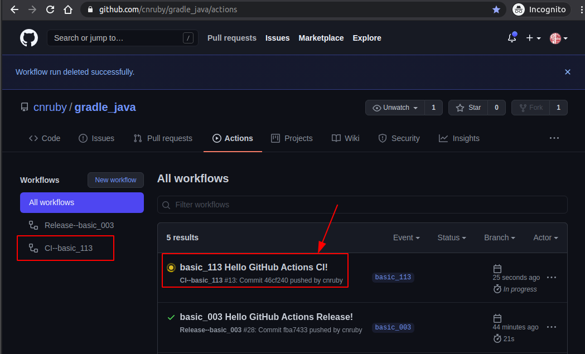
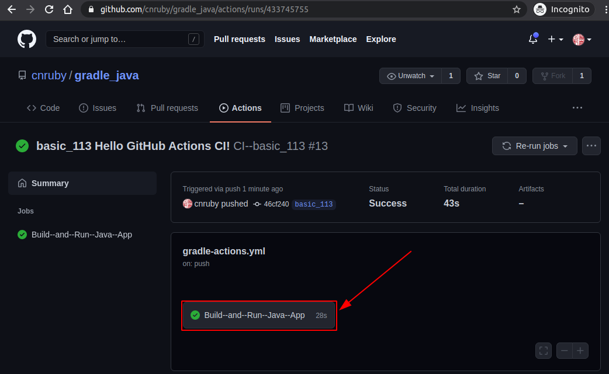
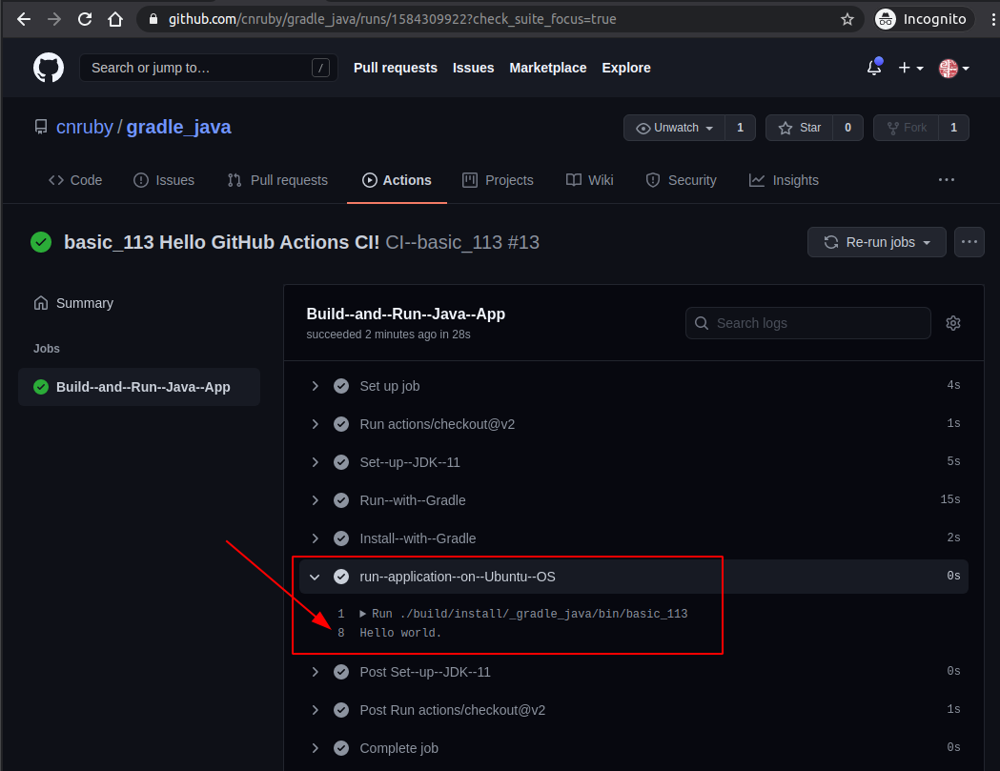

<a href = "https://openjdk.java.net/">

</a>


[](https://ubuntu.com/)
[](https://github.com/shyiko/jabba)
[](https://www.azul.com/downloads/zulu-community/?package=jdk)
[](https://gradle.org/)
[](https://app.circleci.com/pipelines/github/cnruby/gradle_java?branch=basic_113)


basic_113
<h1>Lesson 113: Hello GitHub Actions CI!</h1>

- Develop a Java application with Gradle and GitHub Actions CI

---


- [Keywords](#keywords)
- [Prerequisites](#prerequisites)
- [Create a Java Web Application from GitHub.com](#create-a-java-web-application-from-githubcom)
- [Run the Java application on Local System](#run-the-java-application-on-local-system)
- [Use GitHub Actions CI](#use-github-actions-ci)
  - [Add the CI (GitHub.com) configuration for the project](#add-the-ci-githubcom-configuration-for-the-project)
- [Push the GitHub Action CI file to GitHub](#push-the-github-action-ci-file-to-github)
- [View The GitHub Actions on GibHub.com](#view-the-github-actions-on-gibhubcom)
- [Download and View This complete Project](#download-and-view-this-complete-project)
- [References](#references)


## Keywords
- `Continuous Integration` CI `Continuous Deployment` CD `GitHub Actions`
- Ubuntu Java Gradle tutorial example CircleCI


## Prerequisites
- [install JDK on Ubuntu 20.04](https://github.com/cnruby/gradle_java/blob/basic_101/README.md)
- [install Gradle on Ubuntu 20.04](https://github.com/cnruby/gradle_java/blob/basic_102/README.md)
- [GitHub Account](https://github.com/)


## Create a Java Web Application from GitHub.com

```bash
# DO (open a new terminal)
EXISTING_APP_ID=105 && NEW_APP_ID=113 \
&& git clone -b basic_${EXISTING_APP_ID}  \
    https://github.com/cnruby/gradle_java.git ${NEW_APP_ID}_gradle_java \
&& cd ${NEW_APP_ID}_gradle_java
```


## Run the Java application on Local System

```bash
# DO (run the Java application)
./gradlew run

    # >> RESULT
    > Task :run
    Hello world.

    BUILD SUCCESSFUL in 422ms
    2 actionable tasks: 2 executed
```


## Use GitHub Actions CI

### Add the CI (GitHub.com) configuration for the project

```bash
# DO (create a GitHub Action file)
mkdir -p .github/workflows
touch .github/workflows/gradle_actions.yml

# DO (edit the GitHub Action file)
nano .github/workflows/gradle_actions.yml

    # FILE (.github/workflows/gradle_actions.yml)
    name: CI--basic_113

    # on: [push]
    on: 
      push:
        branches:
          - basic_113

    jobs:
      build:
        name: Build--and--Run--Java--App--for--Gradle
        runs-on: ubuntu-latest

        steps:
        - uses: actions/checkout@v2
        - name: Set--up--JDK--11
          uses: actions/setup-java@v1
          with:
            java-version: 11
            server-id: github
            settings-path: ${{ github.workspace }}

        - name: Run--with--Gradle
          run: ./gradlew run

        - name: Install--with--Gradle
          run: ./gradlew installDist
          
        - name: run--pplication--on--Ubuntu--OS
          run: ./build/install/_gradle_java/bin/basic_113
```


## Push the GitHub Action CI file to GitHub

```bash
# DO (push the file ".github/workflows/gradle_actions.yml" to GitHub.com)
git commit -m "basic_113 Hello GitHub Actions CI!"
git push
```


## View The GitHub Actions on GibHub.com

```bash
# DO (View The GitHub Actions)
google-chrome https://github.com/cnruby/gradle_java/actions
```






## Download and View This complete Project

```bash
# DO (download the whole project)
git clone -b basic_113 https://github.com/cnruby/gradle_java.git basic_113 \
&& cd basic_113
```

```bash
# DO (View the GitHub Actions Ci file)
cat .github/workflows/gradle-actions.yml
```


## References
- https://github.com/actions/setup-java#publishing-using-gradle
