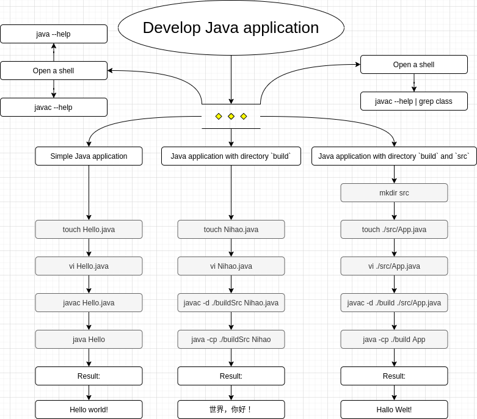

<a href = "https://openjdk.java.net/">

</a>


[](https://ubuntu.com/)
[](https://github.com/shyiko/jabba)
[](https://www.azul.com/downloads/zulu-community/?package=jdk)
[](https://app.circleci.com/pipelines/github/cnruby/gradle_java?branch=basic_101)


<h1>Lesson 101: Hello jabba!</h1>

- install Java Version Manager tool `jabba` on Ubuntu 20.04
- install JDK 8 and/or 11 with jabba on Ubuntu 20.04
- develop simple Java applications

---


- [Keywords](#keywords)
- [Step1:  Install jabba and JDK on Ubuntu 20.04](#step1--install-jabba-and-jdk-on-ubuntu-2004)
  - [map for install jabba and JDK](#map-for-install-jabba-and-jdk)
  - [insatll jabba](#insatll-jabba)
  - [install JDK on Ubuntu 20.04 with jabba](#install-jdk-on-ubuntu-2004-with-jabba)
  - [use Java 8 with jabba](#use-java-8-with-jabba)
  - [use Java 11 with jabba](#use-java-11-with-jabba)
  - [use default Java 11](#use-default-java-11)
  - [use default Java 8](#use-default-java-8)
- [Step 2: Develop Java application](#step-2-develop-java-application)
  - [map for develop Java application](#map-for-develop-java-application)
  - [get initial project version](#get-initial-project-version)
  - [create a simple Java application](#create-a-simple-java-application)
  - [create a Java application with directory `build`](#create-a-java-application-with-directory-build)
  - [create a Java application with directory `build` and `src`](#create-a-java-application-with-directory-build-and-src)
- [Download and Use This compelete Project](#download-and-use-this-compelete-project)
- [References](#references)


## Keywords
- `Java Version Manager` jvm jabba JDK
- java javac compile run `.java` `.class` `Java Class Name` 
- Ubuntu Java tutorial example java8 java11


## Step1:  Install jabba and JDK on Ubuntu 20.04

### map for install jabba and JDK


### insatll jabba
```bash
curl -sL https://github.com/shyiko/jabba/raw/master/install.sh | bash && . ~/.jabba/jabba.sh
```

### install JDK on Ubuntu 20.04 with jabba

```bash
# Java 8
jabba install zulu@~1.8.272
# Java 11
jabba install zulu@1.11.0-9
```

### use Java 8 with jabba
```bash
echo "zulu@1.8.272" > .jabbarc
cat .jabbarc
jabba use
#ONLY the follow command, NOT `java --version`
java -version
echo $JAVA_HOME
type java
```

### use Java 11 with jabba
```bash
echo "zulu@1.11.0-9" > .jabbarc
cat .jabbarc
jabba use
java --version
# OR
java -version
echo $JAVA_HOME
type java
```

### use default Java 11
```bash
# open a shell
jabba alias default zulu@1.11.0-9

# open new shell
java --version
# OR
java -version
```

### use default Java 8
```bash
# open a shell
jabba alias default zulu@1.8.272

#open new shell
# ONLY
java -version
```


## Step 2: Develop Java application

### map for develop Java application


### get initial project version

```bash
git clone -b basic_000 https://github.com/cnruby/gradle_java.git basic_101
cd basic_101
```

### create a simple Java application

```bash
touch Hello.java
vi Hello.java

javac Hello.java

java Hello
>> Hello world!
```

### create a Java application with directory `build`

```bash
touch Nihao.java
vi Nihao.java

javac -d ./buildSrc Nihao.java
#javac -d buildSrc Nihao.java

java -cp ./buildSrc Nihao
#java -cp buildSrc Nihao
#java --class-path ./buildSrc Nihao
#java -classpath ./buildSrc Nihao
>> 世界，你好！
```

### create a Java application with directory `build` and `src`

```bash
mkdir src
touch ./src/App.java
vi ./src/App.java

javac --help
javac --help | grep class

javac -d ./build ./src/App.java
#javac -d build ./src/App.java

java -cp ./build App
#java -cp build App
#java --class-path ./build App
#java -classpath ./build App
>> Hallo Welt!
```


## Download and Use This compelete Project

```bash
# Download
git clone -b basic_101 https://github.com/cnruby/gradle_java.git basic_101
```

```bash
# Use
cd basic_101

javac Hello.java
java Hello

javac -d ./buildSrc Nihao.java
java -cp ./buildSrc Nihao

javac -d ./build ./src/App.java
java -cp ./build App
```


## References
- https://github.com/shyiko/jabba
- JDK! https://developer.okta.com/blog/2019/01/16/which-java-sdk


