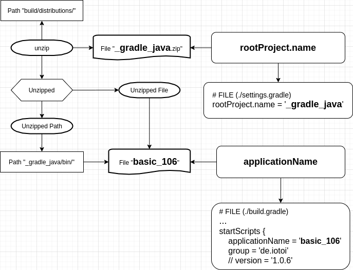

<a href = "https://openjdk.java.net/">

</a>


[](https://ubuntu.com/)
[](https://github.com/shyiko/jabba)
[](https://www.azul.com/downloads/zulu-community/?package=jdk)
[](https://gradle.org/)
[](https://groovy.apache.org/)
[](https://app.circleci.com/pipelines/github/cnruby/gradle_java?branch=basic_106)


basic_106
<h1>Lesson 106: Hello Package!</h1>

- Develop a Java application with Third Package

---


- [Keywords](#keywords)
- [Prerequisites](#prerequisites)
- [Create a Java Application with Gradle](#create-a-java-application-with-gradle)
- [Develop the build file `build.gradle`](#develop-the-build-file-buildgradle)
  - [Add the third Package `Gson` to the Gradle build file `build.gradle`](#add-the-third-package-gson-to-the-gradle-build-file-buildgradle)
  - [build the file `build.gradle`](#build-the-file-buildgradle)
- [Develop the Java application with the Third Package `Gson`](#develop-the-java-application-with-the-third-package-gson)
  - [change the Java Code](#change-the-java-code)
  - [run the Java application on project](#run-the-java-application-on-project)
- [Package the Java application](#package-the-java-application)
  - [build the project](#build-the-project)
  - [run the Java application on different OS System](#run-the-java-application-on-different-os-system)
- [Download and Use This compelete Project](#download-and-use-this-compelete-project)
- [Tip 1: About `applicationName` and `rootProject.name`](#tip-1-about-applicationname-and-rootprojectname)
- [Tip 2: About `mvnrepository.com`](#tip-2-about-mvnrepositorycom)
- [References](#references)


## Keywords
- Third Package Library
- Ubuntu Java Gradle tutorial example `Continuous Integration` CI `Continuous Deployment` CD CircleCI


## Prerequisites
- [install JDK on Ubuntu 20.04](https://github.com/cnruby/gradle_java/blob/basic_101/README.md)
- [install Gradle on Ubuntu 20.04](https://github.com/cnruby/gradle_java/blob/basic_102/README.md)
- [CircleCI Account](https://circleci.com/vcs-authorize/)


## Create a Java Application with Gradle

```bash
git clone -b basic_105 https://github.com/cnruby/gradle_java.git 106_gradle_java
cd 106_gradle_java
sed -i 's/basic_105/basic_106/g' build.gradle
sed -i 's/'1.0.5'/'1.0.6'/g' build.gradle
```


## Develop the build file `build.gradle`

### Add the third Package `Gson` to the Gradle build file `build.gradle`


vi ./build.gradle
```

```bash
# FILE (./build.gradle)
...
dependencies {
  implementation 'org.json:json:20201115'
...
```

### build the file `build.gradle`

```bash
./gradlew
```


## Develop the Java application with the Third Package `Gson`

### change the Java Code

```bash
vi src/main/java/basic_106/App.java
```

```bash
# FILE (src/main/java/basic_106/App.java)
...
        System.out.println(new App().getGreeting());

        LongStream obj = new Random().longs(5,0,10);
        String json = new Gson().toJson(obj.toArray());

        System.out.println("json = " + json);
...
```

### run the Java application on project

```bash
./gradlew run
```

Result:

```bash
> Task :run
Hello world.
json = [3,5,7,6,7]

BUILD SUCCESSFUL in 467ms
2 actionable tasks: 2 executed
```


## Package the Java application
 
### build the project 
```bash
./gradlew clean build
```

### run the Java application on different OS System

```bash
unzip build/distributions/_gradle_java.zip 
./_gradle_java/bin/basic_106
```

Result:

```bash
Hello world.
json = [2,3,9,8,6]
```


## Download and Use This compelete Project

```bash
# Download
git clone -b basic_106 https://github.com/cnruby/gradle_java.git basic_106
```

```bash
# Use
cd basic_106
./gradlew run
```


## Tip 1: About `applicationName` and `rootProject.name`
- About the `applicationName` in the `build.gradle`
- About the `rootProject.name` in the `settings.gradle`




## Tip 2: About `mvnrepository.com`
- The Package Information come from https://mvnrepository.com/


## References
- https://github.com/johnrengelman/shadow